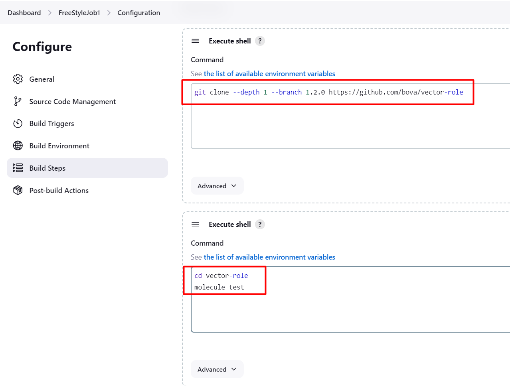
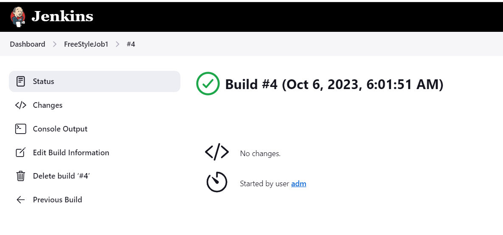
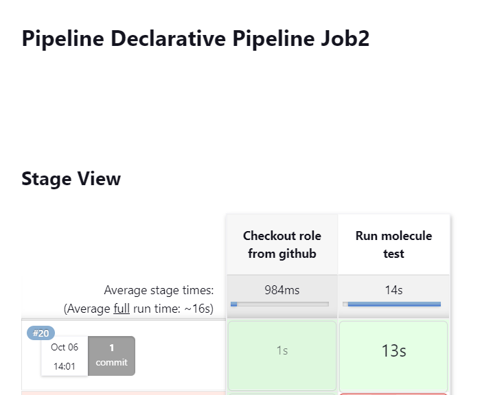

# Домашнее задание к занятию 10 «Jenkins»

1. *Сделать Freestyle Job, который будет запускать molecule test из любого вашего репозитория с ролью.*

**Подготовка на агенте**

pip3 install "molecule==3.5.2"
pip3 install molecule_docker
docker run -dit --name centos7 pycontribs/centos:7 sleep 6000000

**Конфигурация JOB-а**



**Результат сборки**




2. *Сделать Declarative Pipeline Job, который будет запускать molecule test из любого вашего репозитория с ролью.*

**Pipeline script**

```Groovy
pipeline {
    agent any

    stages {
        stage('Checkout role from github') {
            steps {
                checkout scmGit(branches: [[name: '1.2.1']], extensions: [], userRemoteConfigs: [[url: 'https://github.com/bova/vector-role/']])
            }
        }
        stage('Run molecule test') {
            steps {
                sh '''molecule test'''
            }
        }
    }
}

```

**Результат сборки**


