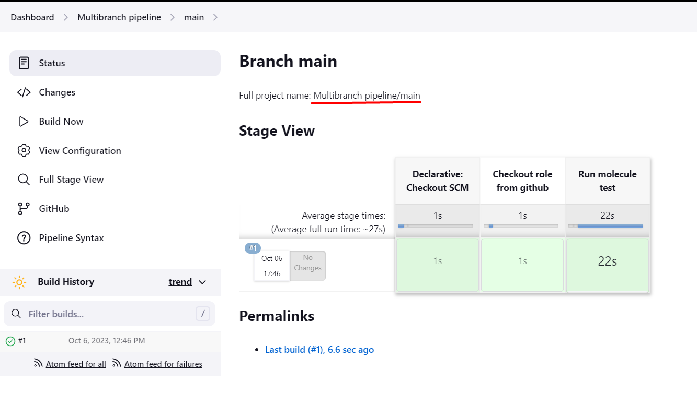
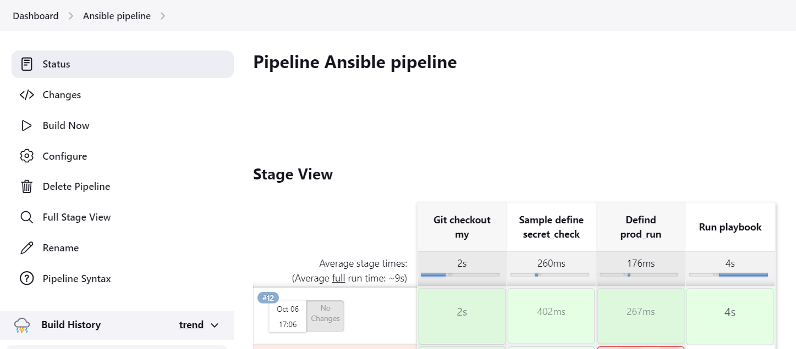

# Домашнее задание к занятию 10 «Jenkins»

## 1. *Сделать Freestyle Job, который будет запускать molecule test из любого вашего репозитория с ролью.*

**Подготовка на агенте**

pip3 install "molecule==3.5.2"
pip3 install molecule_docker
docker run -dit --name centos7 pycontribs/centos:7 sleep 6000000

**Конфигурация JOB-а**


**Результат сборки**


## 2. *Сделать Declarative Pipeline Job, который будет запускать molecule test из любого вашего репозитория с ролью.*

**Pipeline script**

```Groovy
pipeline {
    agent any

    stages {
        stage('Checkout role from github') {
            steps {
                checkout scmGit(branches: [[name: '1.2.1']], extensions: [], userRemoteConfigs: [[url: 'https://github.com/bova/vector-role/']])
            }
        }
        stage('Run molecule test') {
            steps {
                sh '''molecule test'''
            }
        }
    }
}

```

**Результат сборки**


## 3. *Перенести Declarative Pipeline в репозиторий в файл Jenkinsfile.*

**Исходный код Jenkinsfile**: [Jenkinsfile](./home_work/cicd_10/task3/Jenkinsfile)


## 4. *Создать Multibranch Pipeline на запуск Jenkinsfile из репозитория.*

**Результат обнаружения и сборки**



## 6. *Внести необходимые изменения, чтобы Pipeline запускал ansible-playbook без флагов --check --diff, если не установлен параметр при запуске джобы (prod_run = True). По умолчанию параметр имеет значение False и запускает прогон с флагами --check --diff.*

```Groovy
node("linux"){
    stage("Git checkout my") {
        git branch: 'master', credentialsId: '8707a55d-eb8a-485a-9cd4-47a0038ef384', url: 'git@github.com:aragastmatb/example-playbook.git'
    }
    stage("Sample define secret_check"){
        secret_check=true
    }
    stage("Defind prod_run"){
        prod_run = true
    }
    stage("Run playbook"){
        if (prod_run){
            sh 'ansible-playbook site.yml -i inventory/prod.yml'
        }
        else{ 
            sh 'ansible-playbook site.yml -i inventory/prod.yml --check --diff'
        }
        
    }
}
```


## 7. Проверить работоспособность, исправить ошибки, исправленный Pipeline вложить в репозиторий в файл ScriptedJenkinsfile.

**Исходный код ScriptedJenkinsfile**: [ScriptedJenkinsfile](./home_work/cicd_10/task7/ScriptedJenkinsfile)

**Результат сборки**

