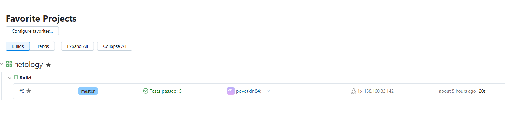
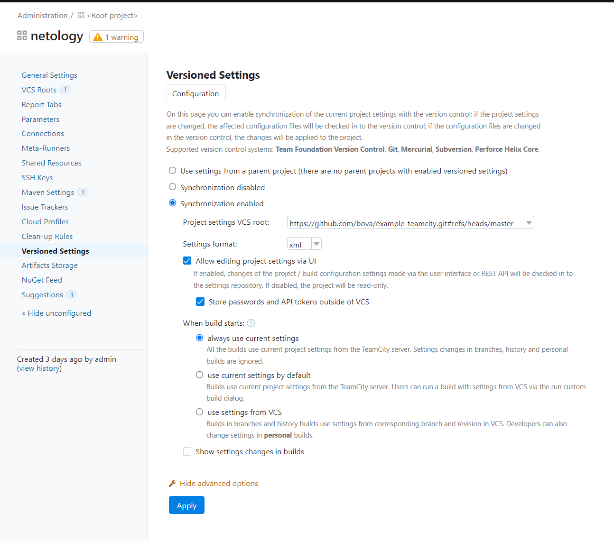
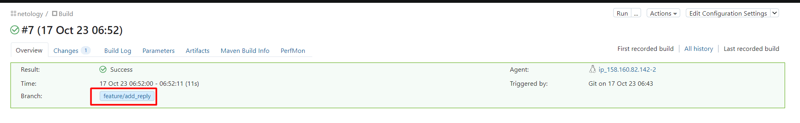
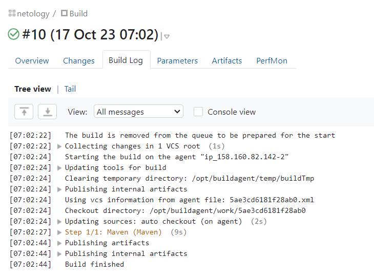
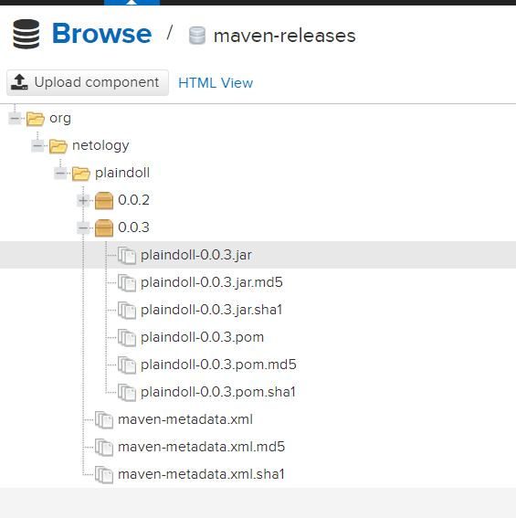
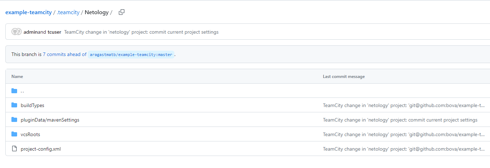

# Домашнее задание к занятию 11 «Teamcity»


## 7. *Запустите сборку по master, убедитесь, что всё прошло успешно и артефакт появился в nexus.*

**Результат сборки**




## *8. Мигрируйте build configuration в репозиторий.*




## *9. Создайте отдельную ветку feature/add_reply в репозитории.*

```
git checkout -b feature/add_reply
```

## *10. Напишите новый метод для класса Welcomer: метод должен возвращать произвольную реплику, содержащую слово hunter.*

```Java
public String sayWish(){
	return "Good luck, hunter"
}
```

## *11. Дополните тест для нового метода на поиск слова hunter в новой реплике.*

```Java
@Test
public void welcomerSaysWish(){
	assertThat(welcomer.sayWish(), containsString("hunter"));
}
```

## *13.Убедитесь, что сборка самостоятельно запустилась, тесты прошли успешно.*

**Результат сборки**



## *17.Проведите повторную сборку мастера, убедитесь, что сбора прошла успешно и артефакты собраны.*

**Результат сборки**



**Артефакты сборки**




## *18.Проверьте, что конфигурация в репозитории содержит все настройки конфигурации из teamcity.*

**Настройки TeamCity в репозитории**



