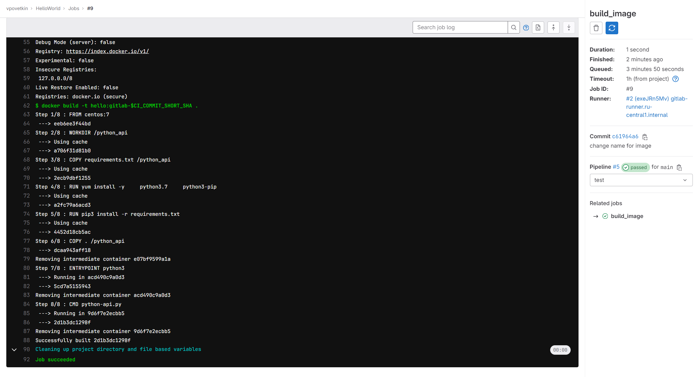
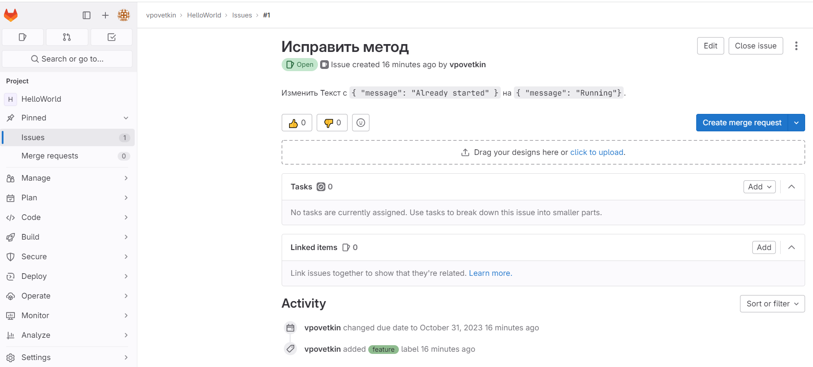
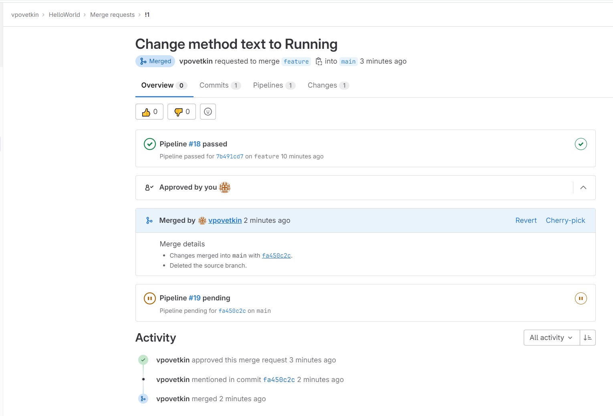
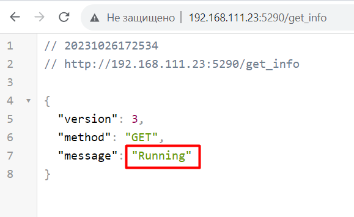
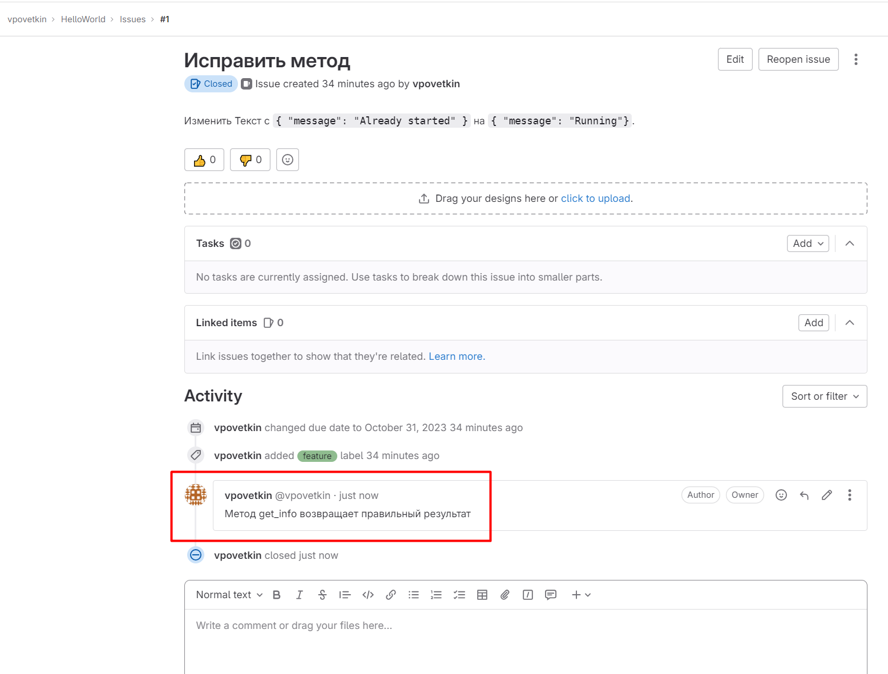

# Домашнее задание к занятию 12 «GitLab»

## Подготовка

Gitlab-runner

```sh
curl -L "https://packages.gitlab.com/install/repositories/runner/gitlab-runner/script.rpm.sh" | sudo bash
yum install gitlab-runner
gitlab-runner register --url https://vpovetkin.gitlab.yandexcloud.net/ --registration-token <token>

usermod -aG root gitlab-runner
sudo -u gitlab-runner -H docker info

```

## DevOps

Проверяем что образ собирается

```sh
docker build --tag python-api .
docker images
docker run -d -p 5000:5000 python-api
```

**Результат сборки**




## Product Owner

**Созданное Issue**




## Developer

**Merge Request**




## Tester

**Подготовка окружения**

```sh
docker login -u <gitlab_user> -p <gitlab_pass> vpovetkin.gitlab.yandexcloud.net
docker run -p 5290:5290 vpovetkin.gitlab.yandexcloud.net:5050/vpovetkin/helloworld/hello:gitlab-fa450c2c
```

**Тест UI**



**Закрытие Issue**




## Итог

* файл gitlab-ci.yml

[gitlab-ci.yml](./home_work/cicd_12/gitlab-ci.yml)

* Dockerfile

[Dockerfile](./home_work/cicd_12/Dockerfile)

* лог успешного выполнения пайплайна

[pipeline_build.log](./home_work/cicd_12/pipeline_build.log)

* решённый Issue


