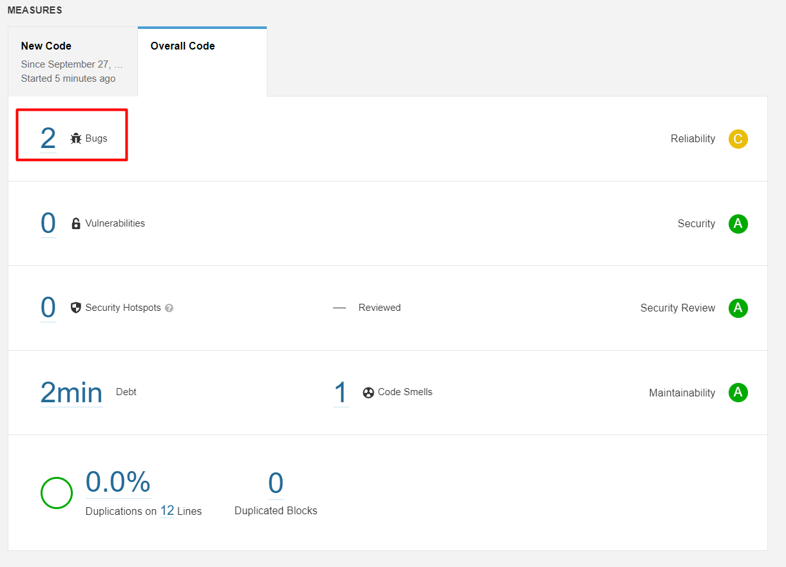
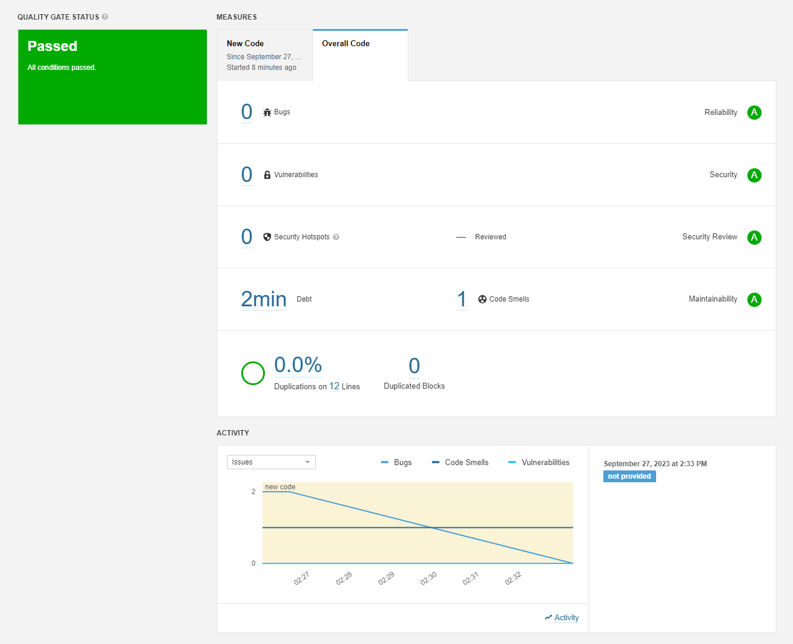

# Домашнее задание к занятию 9 «Процессы CI/CD»

## Знакомоство с SonarQube

### Основная часть

**Изначальный статус**: 

**Статус после исправления кода**: 

## Знакомство с Nexus

### Основная часть

**Результат загрузки в репозиторий maven-public**: [cicd9-task2-1](./home_work/cicd_09/files/maven-metadata.xml)

## Знакомство с Maven

### Основная часть

**POM.XML**: [cicd9-task3-1](./home_work/cicd_09/files/pom.xml)