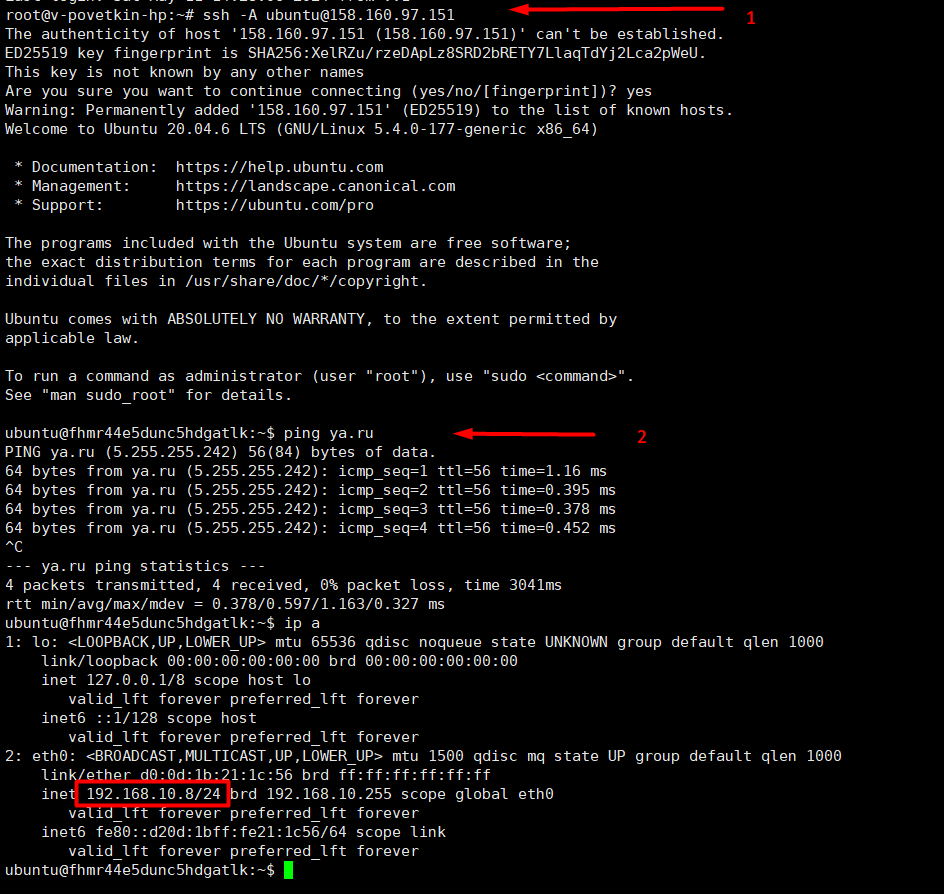
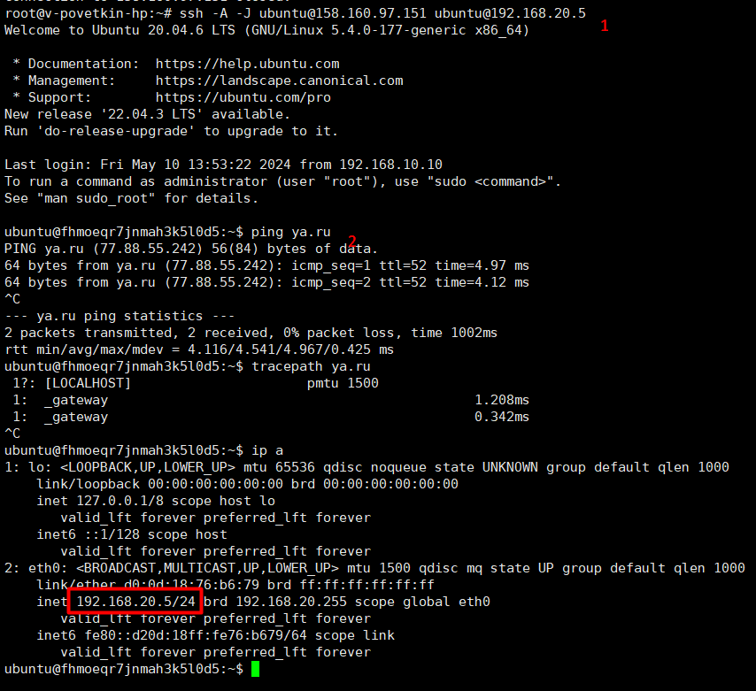

# Домашнее задание к занятию «Организация сети»

## Задание 1. Yandex Cloud

Что нужно сделать

1. Создать пустую VPC. Выбрать зону.
2. Публичная подсеть.

* Создать в VPC subnet с названием public, сетью 192.168.10.0/24.
* Создать в этой подсети NAT-инстанс, присвоив ему адрес 192.168.10.254. В качестве image_id использовать fd80mrhj8fl2oe87o4e1.
* Создать в этой публичной подсети виртуалку с публичным IP, подключиться к ней и убедиться, что есть доступ к интернету.

3. Приватная подсеть

* Создать в VPC subnet с названием private, сетью 192.168.20.0/24.
* Создать route table. Добавить статический маршрут, направляющий весь исходящий трафик private сети в NAT-инстанс.
* Создать в этой приватной подсети виртуалку с внутренним IP, подключиться к ней через виртуалку, созданную ранее, и убедиться, что есть доступ к интернету.

**Решение**

> Network

```HCL
## Network
resource "yandex_vpc_network" "VPC_NETWORK_1" {
  name = var.vpc_name
}

resource "yandex_vpc_subnet" "public" {
  name           = "public"
  zone           = var.default_zone
  network_id     = yandex_vpc_network.VPC_NETWORK_1.id
  v4_cidr_blocks = ["192.168.10.0/24"]
}

resource "yandex_vpc_subnet" "private" {
  name           = "private"
  zone           = var.default_zone
  network_id     = yandex_vpc_network.VPC_NETWORK_1.id
  v4_cidr_blocks = ["192.168.20.0/24"]
  route_table_id = yandex_vpc_route_table.rt-1.id
}

resource "yandex_vpc_route_table" "rt-1" {
  network_id = "${yandex_vpc_network.VPC_NETWORK_1.id}"
  

  static_route {
    destination_prefix = "0.0.0.0/0"
    next_hop_address = "192.168.10.254"        
  }
}
```

> NAT Instance

```HCL
## NAT Instance

data "yandex_compute_image" "ubuntu" {    
  family = var.vm_image_family
}

resource "yandex_compute_instance" "platform" {
  name        = "nat-instance"
  platform_id = "standard-v1"
  resources {
    cores         = 2
    memory        = 2
    core_fraction = 20
  }
  boot_disk {
    initialize_params {
      image_id = "fd86aq92pnsig1u550jm"
    }
  }
  scheduling_policy {
    preemptible = true
  }
  
  network_interface {
    subnet_id = yandex_vpc_subnet.public.id
    nat       = true
    ip_address = "192.168.10.254"
  }
  
  metadata = {
    serial-port-enable = 1
    ssh-keys           = "ubuntu:${var.vms_ssh_root_key}"
  }

}
```

> Public Instance

```HCL
## Instance PUB

resource "yandex_compute_instance" "pub-instance" {
  name        = "pub-instance"
  platform_id = "standard-v1"
  resources {
    cores         = 2
    memory        = 2
    core_fraction = 20
  }
  boot_disk {
    initialize_params {
      image_id = data.yandex_compute_image.ubuntu.image_id
    }
  }
  scheduling_policy {
    preemptible = true
  }
  
  network_interface {
    subnet_id = yandex_vpc_subnet.public.id    
    nat = "true"
  }
  
  metadata = {
    serial-port-enable = 1
    ssh-keys           = "ubuntu:${var.vms_ssh_root_key}"
  }
}
```

> Private Instance

```HCL
## Instance PRiv

resource "yandex_compute_instance" "priv-instance" {
  name        = "priv-instance"
  platform_id = "standard-v1"
  resources {
    cores         = 2
    memory        = 2
    core_fraction = 20
  }
  boot_disk {
    initialize_params {
      image_id = data.yandex_compute_image.ubuntu.image_id
    }
  }
  scheduling_policy {
    preemptible = true
  }
  
  network_interface {
    subnet_id = yandex_vpc_subnet.private.id    
  }
  
  metadata = {
    serial-port-enable = 1
    ssh-keys           = "vpovetkin:${var.vms_ssh_root_key}"
  }
}
```


[Ссылка на исходный код terraform:](./home_work/clopro_01/src))


**Результат**

> Публичная VM



> Приватная VM



