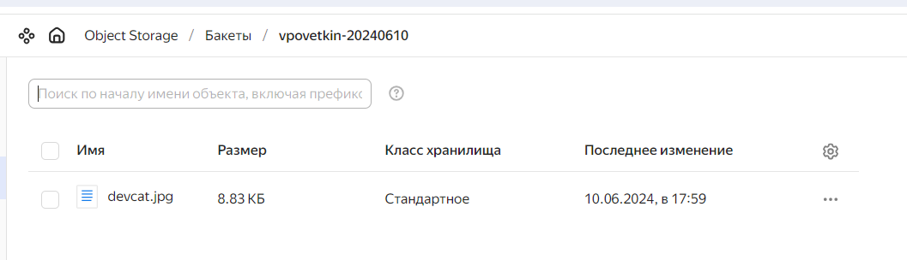
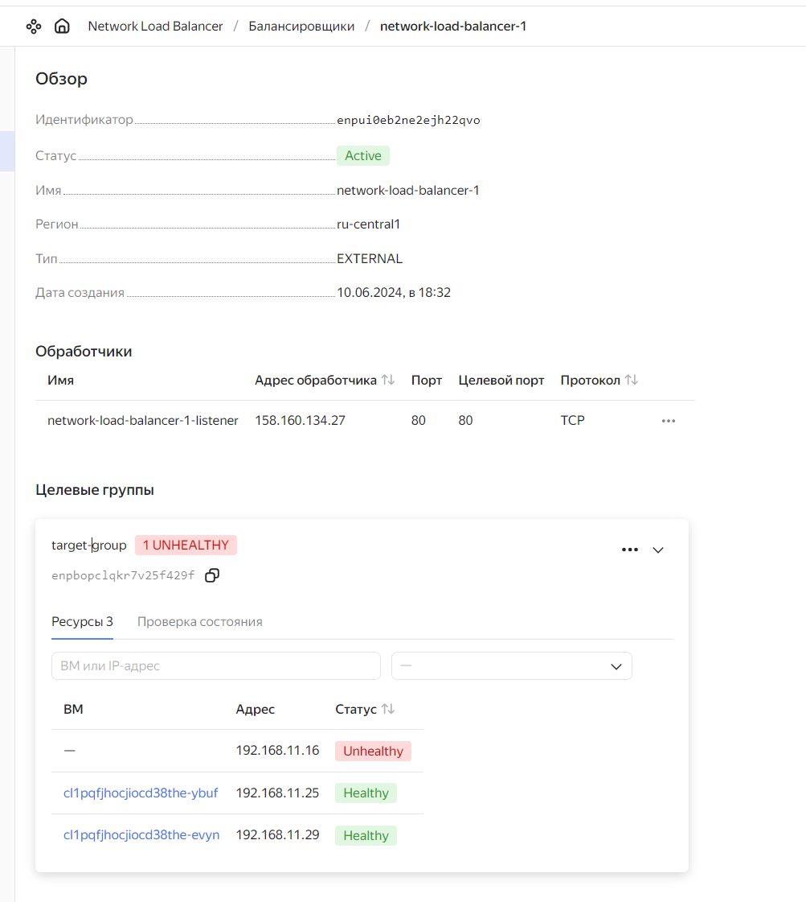

# Домашнее задание к занятию «Организация сети»


## Задание 1. Yandex Cloud

Что нужно сделать

1. Создать бакет Object Storage и разместить в нём файл с картинкой:
1. Создать бакет в Object Storage с произвольным именем (например, имя_студента_дата).
1. Положить в бакет файл с картинкой.
1. Сделать файл доступным из интернета.
1. Создать группу ВМ в public подсети фиксированного размера с шаблоном LAMP и веб-страницей, содержащей ссылку на картинку из бакета:
1. Создать Instance Group с тремя ВМ и шаблоном LAMP. Для LAMP рекомендуется использовать image_id = fd827b91d99psvq5fjit.
1. Для создания стартовой веб-страницы рекомендуется использовать раздел user_data в meta_data.
1. Разместить в стартовой веб-странице шаблонной ВМ ссылку на картинку из бакета.
1. Настроить проверку состояния ВМ.
1. Подключить группу к сетевому балансировщику:
1. Создать сетевой балансировщик.
1. Проверить работоспособность, удалив одну или несколько ВМ.


**Решение**


> Service account

```HCL
resource "yandex_iam_service_account" "ig-sa" {
  name        = "ig-sa"
  description = "Сервисный аккаунт для управления группой ВМ."
}

resource "yandex_resourcemanager_folder_iam_member" "editor" {
  folder_id = var.folder_id
  role      = "editor"
  member    = "serviceAccount:${yandex_iam_service_account.ig-sa.id}"
}
```

> Compute Instance group

```HCL
resource "yandex_compute_instance_group" "ig-1" {
  name                = "fixed-ig-with-balancer"
  folder_id           = var.folder_id
  service_account_id  = "${yandex_iam_service_account.ig-sa.id}"
  deletion_protection = false
  instance_template {
    platform_id = "standard-v1"
    resources {
        cores         = 2
        memory        = 2
        core_fraction = 20
    }
    boot_disk {
      mode = "READ_WRITE"
      initialize_params {
        image_id = "fd827b91d99psvq5fjit"
      }
    }

    network_interface {
      network_id         = "${yandex_vpc_network.VPC_NETWORK_1.id}"
      subnet_ids         = ["${yandex_vpc_subnet.public.id}"]
    #   security_group_ids = ["<список_идентификаторов_групп_безопасности>"]
    }

    metadata = {
      user-data = "${file("cloud-init.yaml")}"        
      ssh-keys           = "ubuntu:${var.vms_ssh_root_key}"
    }
  }

  scale_policy {
    fixed_scale {
      size = 3
    }
  }

  allocation_policy {
    zones = ["ru-central1-a"]
  }

  deploy_policy {
    max_unavailable = 1
    max_expansion   = 0
  }

  load_balancer {
    target_group_name        = "target-group"
    target_group_description = "Целевая группа Network Load Balancer"
  }
}
```

> Load Balancer

```HCL
resource "yandex_lb_network_load_balancer" "lb-1" {
  name = "network-load-balancer-1"

  listener {
    name = "network-load-balancer-1-listener"
    port = 80
    external_address_spec {
      ip_version = "ipv4"
    }
  }

  attached_target_group {
    target_group_id = yandex_compute_instance_group.ig-1.load_balancer.0.target_group_id

    healthcheck {
      name = "http"
      http_options {
        port = 80
        path = "/index.html"
      }
    }
  }
}
```

> Network

```HCL
resource "yandex_vpc_network" "VPC_NETWORK_1" {
  name = var.vpc_name
}

resource "yandex_vpc_subnet" "public" {
  name           = "public2"
  zone           = var.default_zone
  network_id     = yandex_vpc_network.VPC_NETWORK_1.id
  v4_cidr_blocks = ["192.168.11.0/24"]
}
```

> Admin VM

```HCL
data "yandex_compute_image" "ubuntu" {    
  family = var.vm_image_family
}

resource "yandex_compute_instance" "admin-vm" {
  name        = "admin-vm"
  platform_id = "standard-v1"
  resources {
    cores         = 2
    memory        = 2
    core_fraction = 20
  }
  boot_disk {
    initialize_params {
      image_id = data.yandex_compute_image.ubuntu.image_id
    }
  }
  scheduling_policy {
    preemptible = true
  }
  
  network_interface {
    subnet_id = yandex_vpc_subnet.public.id
    nat = "true"
  }
  
  metadata = {
    serial-port-enable = 1
    ssh-keys           = "ubuntu:${var.vms_ssh_root_key}"
  }
}
```

> cloud-init

```yaml
#cloud-config

write_files:
- content: |
    <html>
    <body>
    <p><?php echo "hostname is:".gethostname(); ?></p>
    <p>
    
    </p>
    </body>    
    </html>
  path: /var/www/html/index.html
  defer: true
- content: |
    <html>
    <body>
    <p><?php echo "hostname is:".gethostname(); ?></p>
    <p>
    
    </p>
    </body>    
    </html>
  path: /var/www/html/index.php
  defer: true

```

[Ссылка на исходный код terraform](./home_work/clopro_02/src)


**Результат**

> html страница с картинкой из S3


> Файл в S3



> Демонстрация работы health-check. После удаления VM


