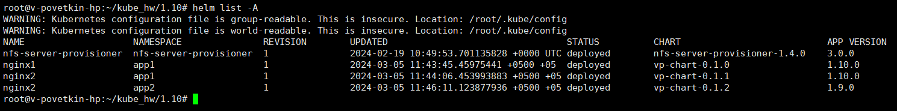

# Домашнее задание к занятию «Helm»

## Задание 1. Подготовить Helm-чарт для приложения

1. Необходимо упаковать приложение в чарт для деплоя в разные окружения.
2. Каждый компонент приложения деплоится отдельным deployment’ом или statefulset’ом.
3. В переменных чарта измените образ приложения для изменения версии.


**Решение**

> helm create vp-chart

```YAML
apiVersion: v2
name: vp-chart
description: A Helm chart for Kubernetes

# A chart can be either an 'application' or a 'library' chart.
#
# Application charts are a collection of templates that can be packaged into versioned archives
# to be deployed.
#
# Library charts provide useful utilities or functions for the chart developer. They're included as
# a dependency of application charts to inject those utilities and functions into the rendering
# pipeline. Library charts do not define any templates and therefore cannot be deployed.
type: application

# This is the chart version. This version number should be incremented each time you make changes
# to the chart and its templates, including the app version.
# Versions are expected to follow Semantic Versioning (https://semver.org/)
version: 0.1.0

# This is the version number of the application being deployed. This version number should be
# incremented each time you make changes to the application. Versions are not expected to
# follow Semantic Versioning. They should reflect the version the application is using.
# It is recommended to use it with quotes.
appVersion: "1.16.0"
```

> helm package vp-chart/


> vi Chart.yaml (Меняем версию образа)

```YAML
apiVersion: v2
name: vp-chart
description: A Helm chart for Kubernetes

# A chart can be either an 'application' or a 'library' chart.
#
# Application charts are a collection of templates that can be packaged into versioned archives
# to be deployed.
#
# Library charts provide useful utilities or functions for the chart developer. They're included as
# a dependency of application charts to inject those utilities and functions into the rendering
# pipeline. Library charts do not define any templates and therefore cannot be deployed.
type: application

# This is the chart version. This version number should be incremented each time you make changes
# to the chart and its templates, including the app version.
# Versions are expected to follow Semantic Versioning (https://semver.org/)
version: 0.1.1

# This is the version number of the application being deployed. This version number should be
# incremented each time you make changes to the application. Versions are not expected to
# follow Semantic Versioning. They should reflect the version the application is using.
# It is recommended to use it with quotes.
appVersion: "1.10.0"
```

> helm package vp-chart/


> vi Chart.yaml (Меняем версию образа)

```
apiVersion: v2
name: vp-chart
description: A Helm chart for Kubernetes

# A chart can be either an 'application' or a 'library' chart.
#
# Application charts are a collection of templates that can be packaged into versioned archives
# to be deployed.
#
# Library charts provide useful utilities or functions for the chart developer. They're included as
# a dependency of application charts to inject those utilities and functions into the rendering
# pipeline. Library charts do not define any templates and therefore cannot be deployed.
type: application

# This is the chart version. This version number should be incremented each time you make changes
# to the chart and its templates, including the app version.
# Versions are expected to follow Semantic Versioning (https://semver.org/)
version: 0.1.2

# This is the version number of the application being deployed. This version number should be
# incremented each time you make changes to the application. Versions are not expected to
# follow Semantic Versioning. They should reflect the version the application is using.
# It is recommended to use it with quotes.
appVersion: "1.9.0"
```

> helm package vp-chart/


## Задание 2. Запустить две версии в разных неймспейсах

1. Подготовив чарт, необходимо его проверить. Запуститe несколько копий приложения.
2. Одну версию в namespace=app1, вторую версию в том же неймспейсе, третью версию в namespace=app2.
3. Продемонстрируйте результат.


> helm install nginx1 vp-chart-0.1.0.tgz -n app1 --create-namespace 

> helm install nginx2 vp-chart-0.1.1.tgz -n app1

> helm install nginx2 vp-chart-0.1.2.tgz -n app2 --create-namespace


*helm list* (Список установленых чартов)

