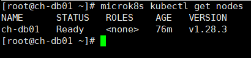
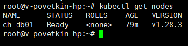
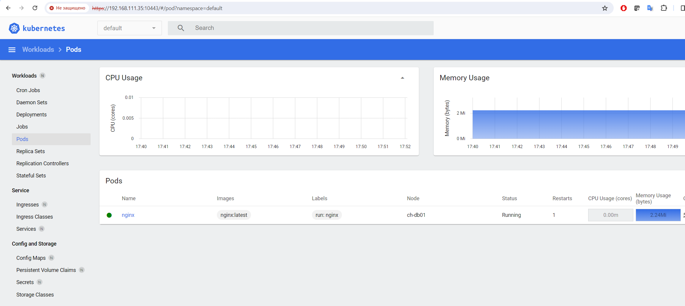

# Домашнее задание к занятию «Kubernetes. Причины появления. Команда kubectl»


## Задание 1. Установка MicroK8S

Установить MicroK8S на локальную машину или на удалённую виртуальную машину.
Установить dashboard.
Сгенерировать сертификат для подключения к внешнему ip-адресу.

**Решение:**

* Установка microK8S

```bash
dnf install epel-release
dnf install snapd
ln -s /var/lib/snapd/snap /snap
echo 'export PATH=$PATH:/var/lib/snapd/snap/bin' | sudo tee -a /etc/profile.d/snap.sh
source /etc/profile.d/snap.sh
systemctl enable --now snapd.socket
setenforce 0
sed -i 's/^SELINUX=.*/SELINUX=permissive/g' /etc/selinux/config

snap install microk8s --classic

usermod -aG microk8s $USER
mkdir ~/.kube
chown -f -R $USER ~/.kube

microk8s status

microk8s kubectl get nodes
microk8s config

microk8s enable dashboard
microk8s enable rbac

microk8s kubectl port-forward -n kube-system service/kubernetes-dashboard 10443:443 --address='0.0.0.0'
```

* Create token

https://github.com/kubernetes/dashboard/blob/master/docs/user/access-control/creating-sample-user.md


**Результат:**

*kubectl get nodes (LOCAL)*




## Задание 2. Установка и настройка локального kubectl

**Решение:**

```bash
curl -LO https://storage.googleapis.com/kubernetes-release/release/`curl -s https://storage.googleapis.com/kubernetes-release/release/stable.txt`/bin/linux/amd64/kubectl;
chmod +x ./kubectl;
mv ./kubectl /usr/local/bin/kubectl;
echo "source <(kubectl completion bash)" >> ~/.bashrc
```

**Результат:**

*kubectl get nodes (REMOTE)*



*Dashboard*

