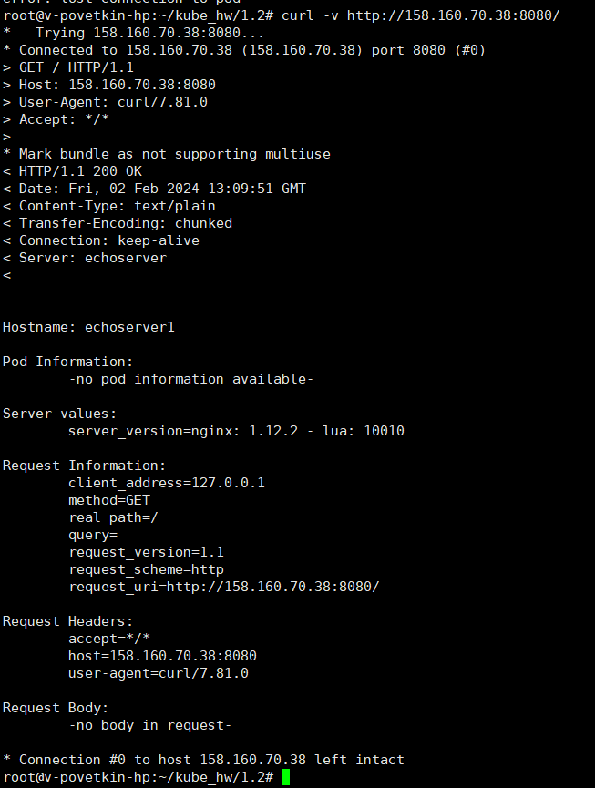
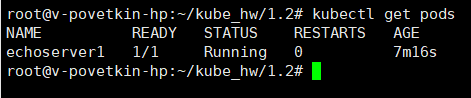
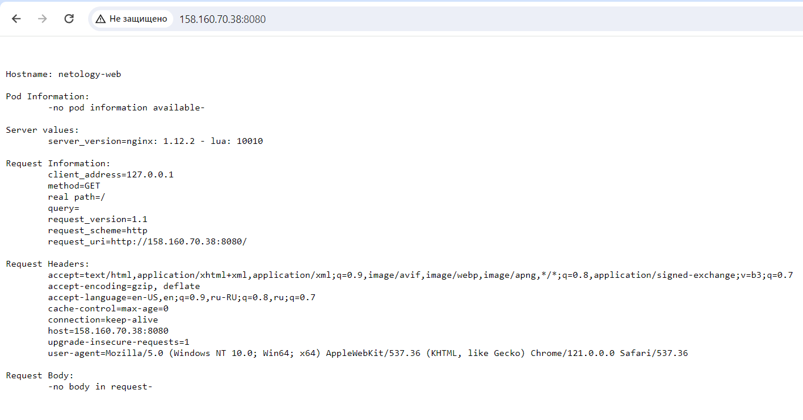
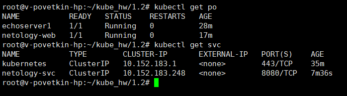

# Домашнее задание к занятию «Kubernetes. Причины появления. Команда kubectl»


## Задание 1. Создать Pod с именем hello-world

1. Создать манифест (yaml-конфигурацию) Pod.
2. Использовать image - gcr.io/kubernetes-e2e-test-images/echoserver:2.2.
3. Подключиться локально к Pod с помощью kubectl port-forward и вывести значение (curl или в браузере).

**Решение**

> vi echoserver.yaml

```
apiVersion: v1
kind: Pod
metadata:
  name: echoserver1
spec:
  containers:
  - name: echoserver
    image: gcr.io/kubernetes-e2e-test-images/echoserver:2.2
    ports:
    - containerPort: 9000
```	

> kubectl apply -f echoserver.yaml
> kubectl port-forward -n default pod/echoserver1 8080:8080 --address='0.0.0.0'

**Результат:**

*curl -v http://158.160.70.38:8080/*



*kubectl get pods*




## Задание 2. Создать Service и подключить его к Pod

1. Создать Pod с именем netology-web.
2. Использовать image — gcr.io/kubernetes-e2e-test-images/echoserver:2.2.
3. Создать Service с именем netology-svc и подключить к netology-web.
4. Подключиться локально к Service с помощью kubectl port-forward и вывести значение (curl или в браузере).

**Решение**

> vi netology-web.yaml

```
apiVersion: v1
kind: Pod
metadata:
  name: netology-web
  labels:
    app: netology-web
spec:
  containers:
  - name: echoserver
    image: gcr.io/kubernetes-e2e-test-images/echoserver:2.2
    ports:
	- containerPort: 8080
```

> kubectl apply -f netology-web.yaml


> vi netology-svc.yaml

```
apiVersion: v1
kind: Service
metadata:
  name: netology-svc
spec:
  selector:
    app: netology-web
  ports:
    - protocol: TCP
      port: 8080
      targetPort: 8080
```

> kubectl apply -f netology-svc.yaml
> microk8s kubectl port-forward -n default service/netology-svc 8080:8080 --address='0.0.0.0'

**Результат:**

*curl -v http://158.160.70.38:8080/*



*kubectl get pods, svc*


