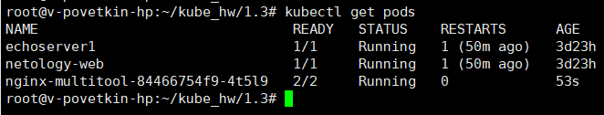
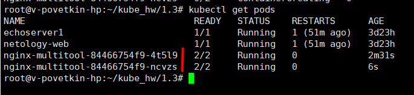
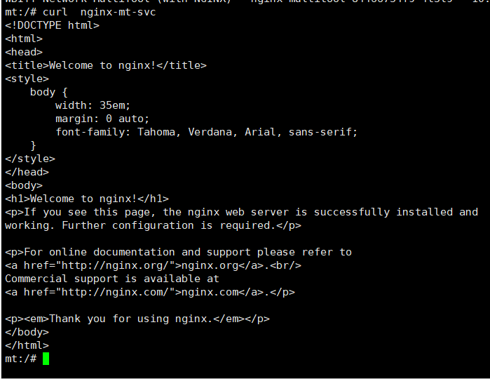
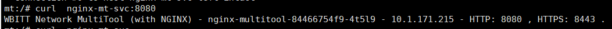
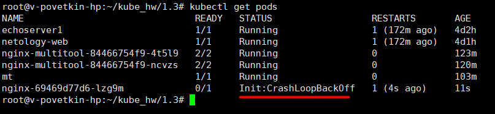
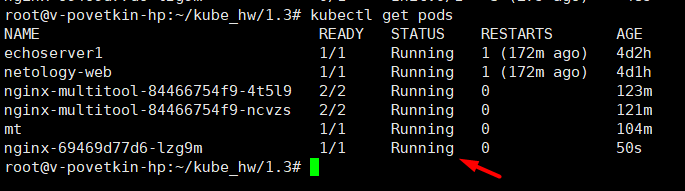

# Домашнее задание к занятию «Запуск приложений в K8S»

## Задание 1. Создать Deployment и обеспечить доступ к репликам приложения из другого Pod

1. Создать Deployment приложения, состоящего из двух контейнеров — nginx и multitool. Решить возникшую ошибку.
2. После запуска увеличить количество реплик работающего приложения до 2.
3. Продемонстрировать количество подов до и после масштабирования.
4. Создать Service, который обеспечит доступ до реплик приложений из п.1.
5. Создать отдельный Pod с приложением multitool и убедиться с помощью curl, что из пода есть доступ до приложений из п.1.


**Решение**

> vi nginx-mt-deployment.yaml

```YAML
apiVersion: apps/v1
kind: Deployment
metadata:
  name: nginx-multitool
  labels:
    app: nginx-mt
spec:
  replicas: 1
  selector:
    matchLabels:
      app: nginx-mt
  template:
    metadata:
      labels:
        app: nginx-mt
    spec:
      containers:
      - name: nginx
        image: nginx:1.14.2
        ports:
        - containerPort: 80
      - name: multitool
        image: wbitt/network-multitool
        ports:
        - containerPort: 8080
        env:
        - name: HTTP_PORT 
          value: "8080"
        - name: HTTPS_PORT
          value: "8443"
```

> kubectl apply -f nginx-mt-deployment.yaml

> vi nginx-mt-svc.yaml

```YAML
apiVersion: v1
kind: Service
metadata:
  name: nginx-mt-svc
spec:
  selector:
    app: nginx-mt
  ports:
    - name: nginx
      protocol: TCP
      port: 80
      targetPort: 80
    - name: mt
      protocol: TCP
      port: 8080
      targetPort: 8080
```

> kubectl apply -f nginx-mt-svc.yaml

Создание отдельно пода

> kubectl run mt --image=wbitt/network-multitool
> kubectl exec -it mt /bin/bash


**Результат:**

*replicas: 1*



*replicas: 2*



*curl  nginx-mt-svc* (Nginx)



*curl  nginx-mt-svc:8080* (Multitool)




## Задание 2. Создать Deployment и обеспечить старт основного контейнера при выполнении условий

1. Создать Deployment приложения nginx и обеспечить старт контейнера только после того, как будет запущен сервис этого приложения.
2. Убедиться, что nginx не стартует. В качестве Init-контейнера взять busybox.
3. Создать и запустить Service. Убедиться, что Init запустился.
4. Продемонстрировать состояние пода до и после запуска сервиса.


**Решение**

> vi nginx-deployment.yaml

```YAML
apiVersion: apps/v1
kind: Deployment
metadata:
  name: nginx
  labels:
    app: nginx
spec:
  replicas: 1
  selector:
    matchLabels:
      app: nginx
  template:
    metadata:
      labels:
        app: nginx
    spec:
      containers:
      - name: nginx
        image: nginx:1.14.2
        ports:
        - containerPort: 80
      initContainers:
      - name: init-nginx
        image: busybox
        command: ['sh', '-c', "for i in {1..300}; do sleep 1; if nslookup nginx.$(cat /var/run/secrets/kubernetes.io/serviceaccount/namespace).svc.cluster.local; then exit 0; fi; done; exit 1"]      
```

> kubectl apply -f nginx-deployment.yaml


> vi nginx-svc.yaml

```YAML
apiVersion: v1
kind: Service
metadata:
  name: nginx
spec:
  selector:
    app: nginx
  ports:
    - name: nginx
      protocol: TCP
      port: 80
      targetPort: 80
```

> kubectl apply -f nginx-svc.yaml


**Результат:**

*kubectl get pods* (Без сервиса)



*kubectl get pods* (С сервисом)



