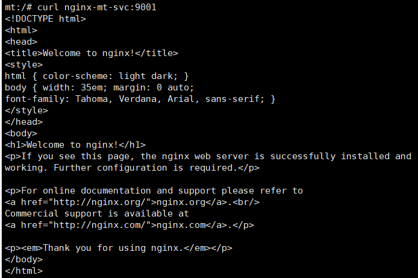
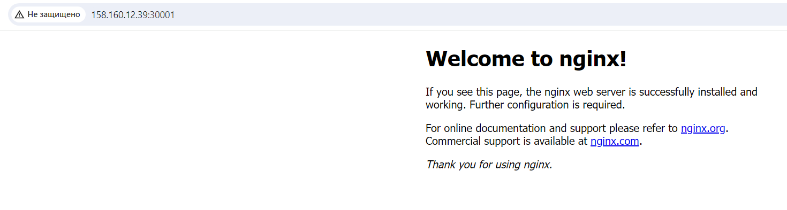

# Домашнее задание к занятию «Сетевое взаимодействие в K8S. Часть 1»


## Задание 1. Создать Deployment и обеспечить доступ к контейнерам приложения по разным портам из другого Pod внутри кластера

1. Создать Deployment приложения, состоящего из двух контейнеров (nginx и multitool), с количеством реплик 3 шт.
2. Создать Service, который обеспечит доступ внутри кластера до контейнеров приложения из п.1 по порту 9001 — nginx 80, по 9002 — multitool 8080.
3. Создать отдельный Pod с приложением multitool и убедиться с помощью curl, что из пода есть доступ до приложения из п.1 по разным портам в разные контейнеры.
4. Продемонстрировать доступ с помощью curl по доменному имени сервиса.
5. Предоставить манифесты Deployment и Service в решении, а также скриншоты или вывод команды п.4.


**Решение**

vi nginx-mt-dep.yaml

```
apiVersion: apps/v1
kind: Deployment
metadata:
  name: nginx-mt-dep
  labels:
    app: nginx-mt-dep
spec:
  replicas: 3
  selector:
    matchLabels:
      app: nginx-mt
  template:
    metadata:
      labels:
        app: nginx-mt
    spec:
      containers:
      - name: nginx
        image: nginx
        ports:
        - containerPort: 80
      - name: multitool
        image: wbitt/network-multitool
        ports:
        - containerPort: 8080
        env:
        - name: HTTP_PORT
          value: "8080"
        - name: HTTPS_PORT
          value: "8443"
```

> kubectl apply -f nginx-mt-dep.yaml


> vi nginx-mt-svc.yaml

```YAML
apiVersion: v1
kind: Service
metadata:
  name: nginx-mt-svc
spec:
  selector:
    app: nginx-mt
  ports:
    - name: nginx
      protocol: TCP
      port: 9001
      targetPort: 80
    - name: mt
      protocol: TCP
      port: 9002
      targetPort: 8080
```

> kubectl apply -f nginx-mt-svc.yaml

Создание отдельно пода

> kubectl run mt --image=wbitt/network-multitool
> kubectl exec -it mt /bin/bash


**Результат:**

*curl  nginx-mt-svc:9001* (Nginx)



*curl  nginx-mt-svc:9002* (Multitool)


## Задание 2. Создать Service и обеспечить доступ к приложениям снаружи кластера

1. Создать отдельный Service приложения из Задания 1 с возможностью доступа снаружи кластера к nginx, используя тип NodePort.
2. Продемонстрировать доступ с помощью браузера или curl с локального компьютера.
3. Предоставить манифест и Service в решении, а также скриншоты или вывод команды п.2.

> vi nginx-np-svc.yaml

```YAML
apiVersion: v1
kind: Service
metadata:
  name: nginx-np-svc
spec:
  type: NodePort
  selector:
    app: nginx-mt
  ports:
    - name: nginx
      protocol: TCP
      port: 9001
      targetPort: 80
	  nodePort: 30001
    - name: mt
      protocol: TCP
      port: 9002
      targetPort: 8080
	  nodePort: 30002
```

> kubectl apply -f nginx-np-svc.yaml


**Результат:**

*http://158.160.12.39:9001* (Nginx)



*http://158.160.12.39:9002* (Multitool)


