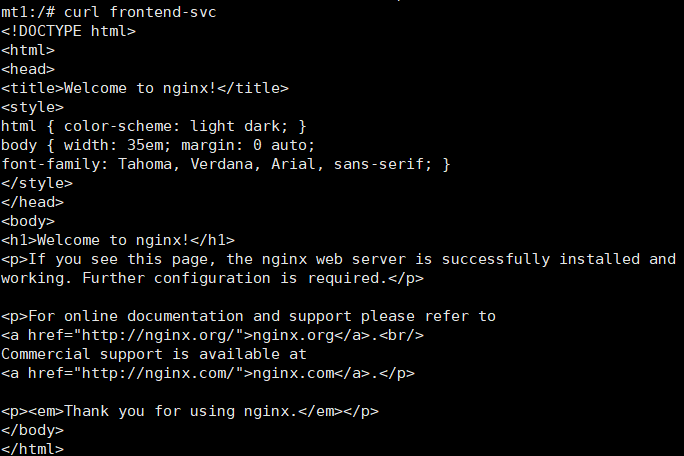
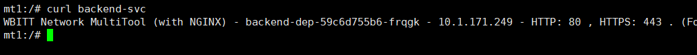
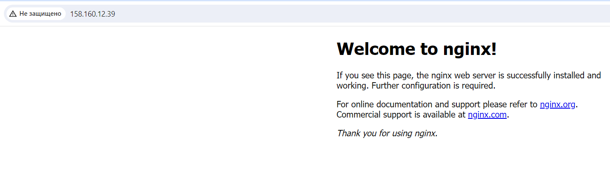
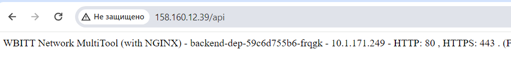

# Домашнее задание к занятию «Сетевое взаимодействие в K8S. Часть 2»

## Задание 1. Создать Deployment приложений backend и frontend

1. Создать Deployment приложения frontend из образа nginx с количеством реплик 3 шт.
2. Создать Deployment приложения backend из образа multitool.
3. Добавить Service, которые обеспечат доступ к обоим приложениям внутри кластера.
4. Продемонстрировать, что приложения видят друг друга с помощью Service.
5. Предоставить манифесты Deployment и Service в решении, а также скриншоты или вывод команды п.4.

**Решение**

> vi backend-dep.yaml

```YAML
apiVersion: apps/v1
kind: Deployment
metadata:
  name: backend-dep
  labels:
    app: backend-dep
spec:
  replicas: 3
  selector:
    matchLabels:
      app: backend
  template:
    metadata:
      labels:
        app: backend
    spec:
      containers:
      - name: multitool
        image: wbitt/network-multitool
        ports:
        - containerPort: 80
```

> vi frontend-dep.yaml

```YAML
apiVersion: apps/v1
kind: Deployment
metadata:
  name: frontend-dep
  labels:
    app: frontend-dep
spec:
  replicas: 3
  selector:
    matchLabels:
      app: frontend
  template:
    metadata:
      labels:
        app: frontend
    spec:
      containers:	
      - name: nginx
        image: nginx
        ports:
        - containerPort: 80
```

> kubectl apply -f backend-dep.yaml

> kubectl apply -f frontend-dep.yaml


> vi backend-svc.yaml

```YAML
apiVersion: v1
kind: Service
metadata:
  name: backend-svc
spec:
  selector:
    app: backend
  ports:
    - name: web
      protocol: TCP
      port: 80
      targetPort: 80
```

> vi frontend-svc.yaml

```YAML
apiVersion: v1
kind: Service
metadata:
  name: frontend
spec:
  selector:
    app: frontend-dep
  ports:
    - name: web
      protocol: TCP
      port: 80
      targetPort: 80
```

> kubectl apply -f backend-svc.yaml

> kubectl apply -f frontend-svc.yaml

Запуск пода для тестирования

> kubectl run mt1 --image=wbitt/network-multitool -it --rm /bin/bash


**Результат:**

*curl  frontend-svc* (Nginx)



*curl  backend-svc* (Multitool)




## Задание 2. Создать Ingress и обеспечить доступ к приложениям снаружи кластера


1. Включить Ingress-controller в MicroK8S.
2. Создать Ingress, обеспечивающий доступ снаружи по IP-адресу кластера MicroK8S так, чтобы при запросе только по адресу открывался frontend а при добавлении /api - backend.
3. Продемонстрировать доступ с помощью браузера или curl с локального компьютера.
4. Предоставить манифесты и скриншоты или вывод команды п.2.

**Решение**

> microk8s enable ingress

> vi ingress.yaml

```YAML
apiVersion: networking.k8s.io/v1
kind: Ingress
metadata:
  name: http-ingress
  annotations:
    nginx.ingress.kubernetes.io/rewrite-target: /
spec:
  rules:
  - http:
      paths:
      - path: /
        pathType: Prefix
        backend:
          service:
            name: frontend-svc
            port:
              number: 80
      - path: /api
        pathType: Prefix
        backend:
          service:
            name: backend-svc
            port:
              number: 80
```			  

**Результат:**

*http://158.160.12.39* (Nginx)



*http://158.160.12.39/api* (Multitool)


