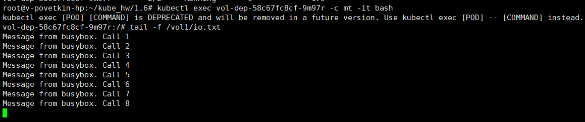
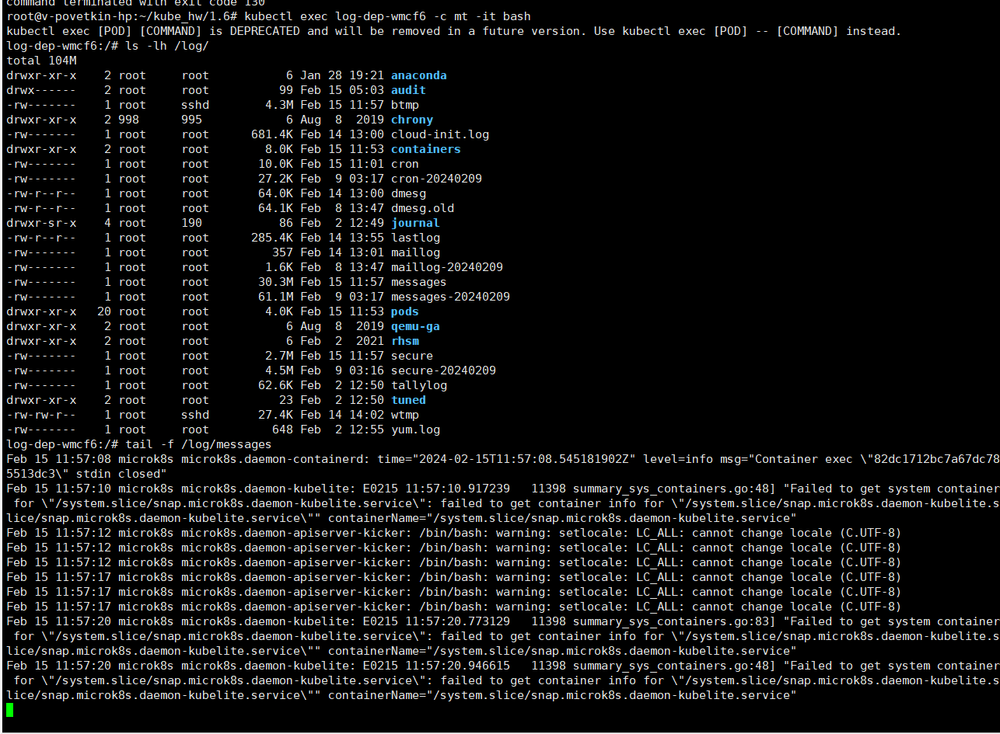

# Домашнее задание к занятию «Хранение в K8s. Часть 1»


## Задание 1


Создать Deployment приложения, состоящего из двух контейнеров и обменивающихся данными.

1. Создать Deployment приложения, состоящего из контейнеров busybox и multitool.
2. Сделать так, чтобы busybox писал каждые пять секунд в некий файл в общей директории.
3. Обеспечить возможность чтения файла контейнером multitool.
4. Продемонстрировать, что multitool может читать файл, который периодоически обновляется.
5. Предоставить манифесты Deployment в решении, а также скриншоты или вывод команды из п. 4.

**Решение**

> vi vol-dep.yaml

```YAML
apiVersion: apps/v1
kind: Deployment
metadata:
  name: vol-dep
  labels:
    app: vol-dep
spec:
  replicas: 1
  selector:
    matchLabels:
      app: vol-app
  template:
    metadata:
      labels:
        app: vol-app
    spec:
      containers:
      - name: bb
        image: busybox
        command: ['sh', '-c', 'i=1; while [ $i -le 1000 ]; do  echo "Message from busybox. Call $i" >> /vol1/io.txt; sleep 5; i=$(( $i + 1 )); done']
        volumeMounts:
        - mountPath: /vol1
          name: vol1
      - name: mt
        image: wbitt/network-multitool
        volumeMounts:
        - mountPath: /vol1
          name: vol1        
        ports:
        - containerPort: 80
      volumes:
      - name: vol1
        emptyDir: {}
```

> kubectl apply -f vol-dep.yaml 

Подключение к контейнеру MultiTool

> kubectl exec vol-dep-65b5fd76c-pvrdw -c mt -it bash


**Результат:**

*tail -f /vol1/io.txt* (MultiTool)




## Задание 2


Создать DaemonSet приложения, которое может прочитать логи ноды.

1. Создать DaemonSet приложения, состоящего из multitool.
2. Обеспечить возможность чтения файла /var/log/syslog кластера MicroK8S.
3. Продемонстрировать возможность чтения файла изнутри пода.
4. Предоставить манифесты Deployment, а также скриншоты или вывод команды из п. 2.


**Решение**

> vi log-dep.yaml

```YAML
apiVersion: apps/v1
kind: DaemonSet
metadata:
  name: log-dep
  labels:
    app: log-dep
spec:
  selector:
    matchLabels:
      app: syslog-app
  template:
    metadata:
      labels:
        app: syslog-app
    spec:
      containers:
      - name: mt
        image: wbitt/network-multitool
        volumeMounts:
        - mountPath: /log
          name: logvol       
        ports:
        - containerPort: 80
      volumes:
      - name: logvol
        hostPath:
          path: /var/log
```

Подключение к контейнеру MultiTool

> kubectl exec log-dep-wmcf6 -c mt -it bash


**Результат:**

*ls -lh /log/; tail -f /log/messages* (MultiTool)

