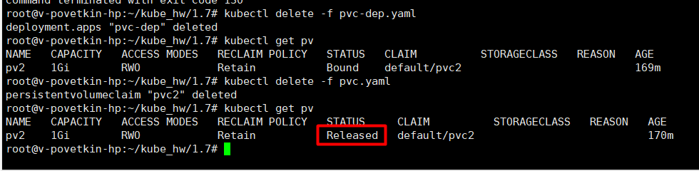
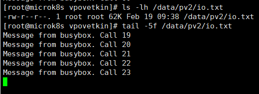
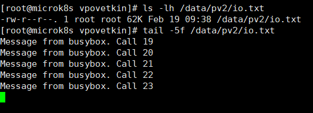
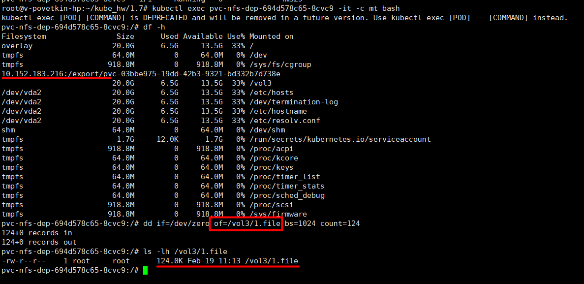
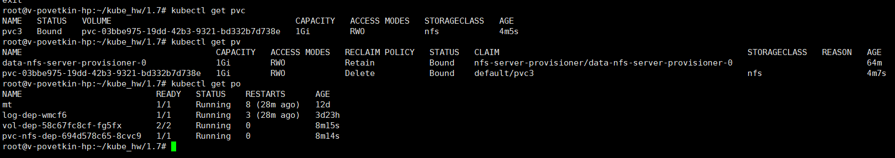

# Домашнее задание к занятию «Хранение в K8s. Часть 2»


## Задание 1


Создать Deployment приложения, использующего локальный PV, созданный вручную.

1. Создать Deployment приложения, состоящего из контейнеров busybox и multitool.
2. Создать PV и PVC для подключения папки на локальной ноде, которая будет использована в поде.
3. Продемонстрировать, что multitool может читать файл, в который busybox пишет каждые пять секунд в общей директории.
4. Удалить Deployment и PVC. Продемонстрировать, что после этого произошло с PV. Пояснить, почему.
5. Продемонстрировать, что файл сохранился на локальном диске ноды. Удалить PV. Продемонстрировать что произошло с файлом после удаления PV. Пояснить, почему.

**Решение**

> microk8s enable hostpath-storage

> vi pv.yaml

```YAML
apiVersion: v1
kind: PersistentVolume
metadata: 
  name: pv2
spec:
  capacity:
    storage: 1Gi
  accessModes:
  - ReadWriteOnce
  hostPath:
    path: /data/pv2  
```

> vi pvc.yaml

```YAML
apiVersion: v1
kind: PersistentVolumeClaim
metadata:
  name: pvc2
  namespace: default
spec:
  storageClassName: ""
  volumeMode: Filesystem
  accessModes:
  - ReadWriteOnce
  resources:
    requests:
      storage: 1Gi
```

> vi pvc-dep.yaml

```YAML
kind: Deployment
metadata:
  name: pvc-dep
  labels:
    app: pvc-dep
spec:
  replicas: 1
  selector:
    matchLabels:
      app: pvc-app
  template:
    metadata:
      labels:
        app: pvc-app
    spec:
      containers:
      - name: bb
        image: busybox
        command: ['sh', '-c', 'i=1; while [ $i -le 1000 ]; do  echo "Message from busybox. Call $i" >> /vol2/io.txt; sleep 5; i=$(( $i + 1 )); done']
        volumeMounts:
        - mountPath: /vol2
          name: vol2
      - name: mt
        image: wbitt/network-multitool
        volumeMounts:
        - mountPath: /vol2
          name: vol2        
        ports:
        - containerPort: 80
      volumes:
      - name: vol2
        persistentVolumeClaim:
          claimName: pvc2
```

> kubectl apply -f vol-dep.yaml 

Подключение к контейнеру MultiTool

> kubectl exec pvc-dep-8579599f55-4n26m -c mt -it bash


**Результат:**

*tail -f /vol2/io.txt* (MultiTool)


*kubectl delete -f pvc-dep.yaml*

*kubectl delete -f pvc.yaml*



Данные доступны, так как существует PV



*kubectl delete -f pv.yaml*

Данные доступны, так как политика переиспользования ресурсов по умолчанию - Retain




## Задание 2


Создать Deployment приложения, которое может хранить файлы на NFS с динамическим созданием PV.

Включить и настроить NFS-сервер на MicroK8S.
Создать Deployment приложения состоящего из multitool, и подключить к нему PV, созданный автоматически на сервере NFS.
Продемонстрировать возможность чтения и записи файла изнутри пода.
Предоставить манифесты, а также скриншоты или вывод необходимых команд.


> microk8s enable community

> microk8s enable nfs


> vi pvc-nfs.yaml

```YAML
apiVersion: v1
kind: PersistentVolumeClaim
metadata:
  name: pvc3
  namespace: default
spec:
  storageClassName: "nfs"
  accessModes:
  - ReadWriteOnce
  resources:
    requests:
      storage: 1Gi
```

> vi pvc-nfs-dep.yaml

```YAML
apiVersion: apps/v1
kind: Deployment
metadata:
  name: pvc-nfs-dep
  labels:
    app: pvc-nfs-dep
spec:
  replicas: 1
  selector:
    matchLabels:
      app: pvc-nfs-app
  template:
    metadata:
      labels:
        app: pvc-nfs-app
    spec:
      containers:
      - name: mt
        image: wbitt/network-multitool
        volumeMounts:
        - mountPath: /vol3
          name: vol3        
        ports:
        - containerPort: 80
      volumes:
      - name: vol3
        persistentVolumeClaim:
          claimName: pvc3
```

Подключение к контейнеру MultiTool

> kubectl exec pvc-nfs-dep-694d578c65-8cvc9 -it -c mt bash


**Результат:**

*dd ... /vol3/1.file; ls -lh ...* (MultiTool)




*pvc, pv, pod*


