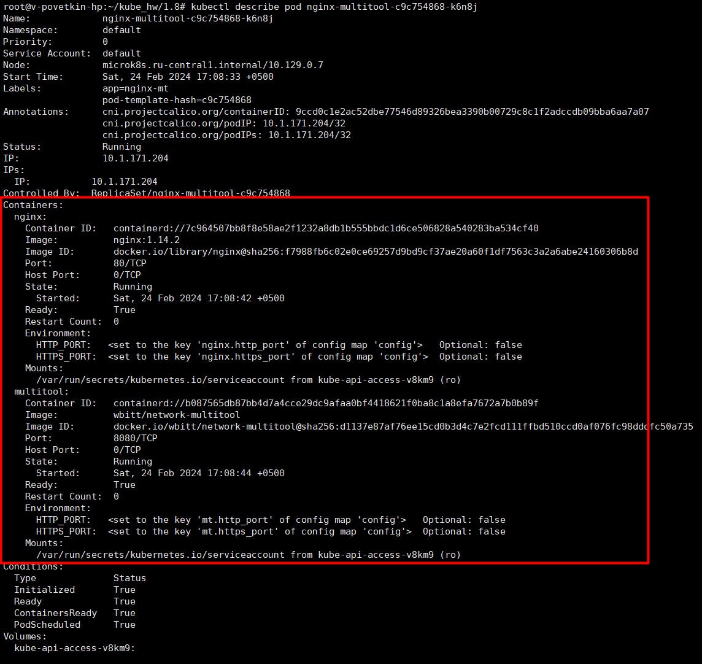
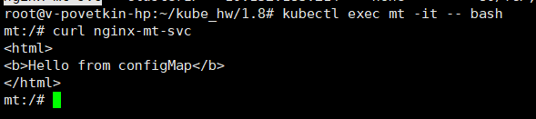
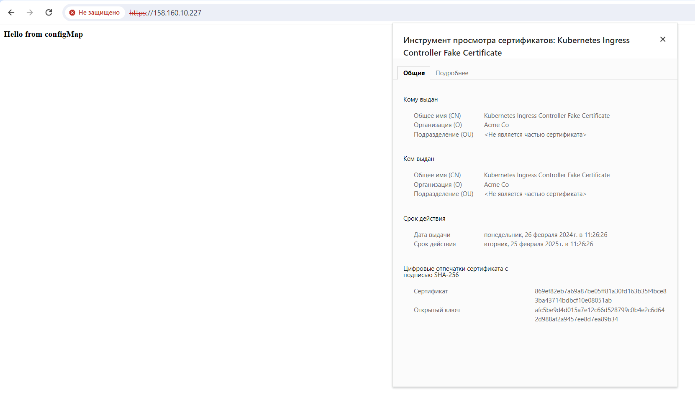

# Домашнее задание к занятию «Конфигурация приложений»


## Задание 1. Создать Deployment приложения и решить возникшую проблему с помощью ConfigMap. Добавить веб-страницу

1. Создать Deployment приложения, состоящего из контейнеров nginx и multitool.
2. Решить возникшую проблему с помощью ConfigMap.
3. Продемонстрировать, что pod стартовал и оба конейнера работают.
4. Сделать простую веб-страницу и подключить её к Nginx с помощью ConfigMap. Подключить Service и показать вывод curl или в браузере.
5. Предоставить манифесты, а также скриншоты или вывод необходимых команд.


**Решение**

> vi config.yaml

```YAML
apiVersion: v1
kind: ConfigMap
metadata:
  name: config
data:
  nginx.http_port: "80"
  nginx.https_port: "443"
  mt.http_port: "8080"
  mt.https_port: "8443"
```

> vi nginx_index.yaml

```YAML
apiVersion: v1
kind: ConfigMap
metadata:
  name: nginx.index
data:
  index.html: |
    <html>
    <b>Hello from configMap</b>
    </html>
```


> vi nginx-mt-dep.yaml

```YAML
apiVersion: apps/v1
kind: Deployment
metadata:
  name: nginx-multitool
  labels:
    app: nginx-mt
spec:
  replicas: 1
  selector:
    matchLabels:
      app: nginx-mt
  template:
    metadata:
      labels:
        app: nginx-mt
    spec:
      containers:
      - name: nginx
        image: nginx:1.14.2
        volumeMounts:
          - name: index
            mountPath: /usr/share/nginx/html/
            readOnly: true        
        ports:
        - containerPort: 80
        env:
        - name: HTTP_PORT 
          valueFrom:
            configMapKeyRef:
              name: config
              key: nginx.http_port        
        - name: HTTPS_PORT
          valueFrom:
            configMapKeyRef:
              name: config
              key: nginx.https_port     
      - name: multitool
        image: wbitt/network-multitool
        ports:
        - containerPort: 8080
        env:
        - name: HTTP_PORT 
          valueFrom:
            configMapKeyRef:
              name: config
              key: mt.http_port       
        - name: HTTPS_PORT
          valueFrom:
            configMapKeyRef:
              name: config
              key: mt.https_port
      volumes:
      - name: index
        configMap:
          name: nginx.index   
```

> vi nginx-mt-svc.yaml

```YAML
apiVersion: v1
kind: Service
metadata:
  name: nginx-mt-svc
spec:
  selector:
    app: nginx-mt
  ports:
    - name: nginx
      protocol: TCP
      port: 80
      targetPort: 80
    - name: mt
      protocol: TCP
      port: 8080
      targetPort: 8080
```

**Результат:**

*kubectl describe pod nginx-multitool-c9c754868-k6n8j*



*kubectl exec mt -it -- bash*

*curl nginx-mt-svc*




## Задание 2. Создать приложение с вашей веб-страницей, доступной по HTTPS

1. Создать Deployment приложения, состоящего из Nginx.
2. Создать собственную веб-страницу и подключить её как ConfigMap к приложению.
3. Выпустить самоподписной сертификат SSL. Создать Secret для использования сертификата.
4. Создать Ingress и необходимый Service, подключить к нему SSL в вид. Продемонстировать доступ к приложению по HTTPS.
5. Предоставить манифесты, а также скриншоты или вывод необходимых команд.


**Решение**

Deployment и Service используем из первого задания

> openssl req -x509 -nodes -days 365 -newkey rsa:2048 -keyout /tmp/nginx-selfsigned.key -out /tmp/nginx-selfsigned.crt

> microk8s enable ingress

> vi nginx_tls.yaml

```YAML
apiVersion: v1
kind: Secret
metadata:
  name: nginx-tls
  namespace: default
data:
  tls.crt: |
    LS0tLS1CRUdJTiBDRVJUSUZJQ0FURS0tLS0tCk1JSURhekNDQWxPZ0F3SUJBZ0lVTVNHUXN5c2t0
    YXRQTFFpM2h3Vm1FdXgwTU5Zd0RRWUpLb1pJaHZjTkFRRUwKQlFBd1JURUxNQWtHQTFVRUJoTUNW
    Vm94RXpBUkJnTlZCQWdNQ2xOdmJXVXRVM1JoZEdVeElUQWZCZ05WQkFvTQpHRWx1ZEdWeWJtVjBJ
    RmRwWkdkcGRITWdVSFI1SUV4MFpEQWVGdzB5TkRBeU1qWXdOakl5TWpSYUZ3MHlOVEF5Ck1qVXdO
    akl5TWpSYU1FVXhDekFKQmdOVkJBWVRBbFZhTVJNd0VRWURWUVFJREFwVGIyMWxMVk4wWVhSbE1T
    RXcKSHdZRFZRUUtEQmhKYm5SbGNtNWxkQ0JYYVdSbmFYUnpJRkIwZVNCTWRHUXdnZ0VpTUEwR0NT
    cUdTSWIzRFFFQgpBUVVBQTRJQkR3QXdnZ0VLQW9JQkFRQzFBcVlab0JxdHhsUmo1T0hpcXFvYmNz
    a1ZVazdlSkJvM0UzOGtaWkR0CkFPL214RDdJQnJoNGVNMk1ITGJ2TXZRRDRUNm1vTWFjbHBhVk93
    bS9la0NXSGJ1eTFUR0xiY2RMUnlGckdON24KbDlRN29VV3JlcENNcmQybFM4MkNqazBKQ0QzSUl4
    SUNHOWkyeGpoZmVnSUNsY0RhVXgvYVRPSDZKRXpBcE1QUgprYm41NVBYOGNKb3hFbVJGcnpCY3hp
    cEVHMno0ZXVvM1dTUFlLeFpvSjd3YmF3NVFPdW5wWHJyUUNsNEUzd2hxCmM0d2xTalJObjA0TzRN
    akR1bmtEelNVZnRDTmRhOTloZWQ2WlJrUW10Z0l0VVc5a0J2WGtqdGtLTEJrV1pDVS8KOGp2K3pq
    a0lBdFBKai8zajRCY1M2d3dFSnBsZTlaYU45RXA4RjhsRjdXU3pBZ01CQUFHalV6QlJNQjBHQTFV
    ZApEZ1FXQkJSaXRzd01nUWtKeERiWXh0eW1JUGI4emo1aS9EQWZCZ05WSFNNRUdEQVdnQlJpdHN3
    TWdRa0p4RGJZCnh0eW1JUGI4emo1aS9EQVBCZ05WSFJNQkFmOEVCVEFEQVFIL01BMEdDU3FHU0li
    M0RRRUJDd1VBQTRJQkFRQ08KMWZ2cnhWRUl3RzA5azdZTjI5aUc4dmRsWnJpWTAyb1NZZHpGRXJj
    dWZZRlYwbUhCVWxxeWlidmhaak85amxiUQpxTmF5dDQ0elhBQ0dPamhoZFAzTllXVVk5NHdzOXBD
    SlpJK2RxVlZ5ZGhVSkJQMmYvMlFUOEdEdzVuSU5IbGdZCkF0ZTVNaVp4RUdPd08rdVVKS2lZNEs3
    Ym9KdVFMVTVJbzJXT3MzL1pEenFraXhubzdFV3lLL0o0cGUvQUJseVQKcUdSR3FLRWNtRHJJWnJE
    aFY0Z1pNZ0o4eEYza1UrZWVEYTFaL0xCK1UybGhYSjUwaVVva0RLSEtRY1lta1FSOApESWhaVHJ3
    a3RVaC9FRHQ5cU9qaXZ6WkVwWHRSVkRTMHBNUlI5cU9JWHlreTZjUnVwbFVzUTI4Z2JSM2g2QVQ1
    CkViZVZKZFp3ZTBaYkIrN2paakoxCi0tLS0tRU5EIENFUlRJRklDQVRFLS0tLS0K
  tls.key: |
    LS0tLS1CRUdJTiBQUklWQVRFIEtFWS0tLS0tCk1JSUV2UUlCQURBTkJna3Foa2lHOXcwQkFRRUZB
    QVNDQktjd2dnU2pBZ0VBQW9JQkFRQzFBcVlab0JxdHhsUmoKNU9IaXFxb2Jjc2tWVWs3ZUpCbzNF
    MzhrWlpEdEFPL214RDdJQnJoNGVNMk1ITGJ2TXZRRDRUNm1vTWFjbHBhVgpPd20vZWtDV0hidXkx
    VEdMYmNkTFJ5RnJHTjdubDlRN29VV3JlcENNcmQybFM4MkNqazBKQ0QzSUl4SUNHOWkyCnhqaGZl
    Z0lDbGNEYVV4L2FUT0g2SkV6QXBNUFJrYm41NVBYOGNKb3hFbVJGcnpCY3hpcEVHMno0ZXVvM1dT
    UFkKS3hab0o3d2JhdzVRT3VucFhyclFDbDRFM3docWM0d2xTalJObjA0TzRNakR1bmtEelNVZnRD
    TmRhOTloZWQ2WgpSa1FtdGdJdFVXOWtCdlhranRrS0xCa1daQ1UvOGp2K3pqa0lBdFBKai8zajRC
    Y1M2d3dFSnBsZTlaYU45RXA4CkY4bEY3V1N6QWdNQkFBRUNnZ0VBTjJ6eHRtd0hiMG1KQXJPTmxV
    NEQyM2JJNnQzeXAyT3ZvVWkzaUVvUFYvc08KK244QjZGYmllb1VuRDIybGVGWUdVUC9TSXN5ZE5F
    cUtIblRlOWNJMTc2RjRIWGpaZkdPbmdEM3VGakNkNUpWaApsOGE0b2hyY0V5K1Q3RzdySlR4MGl6
    ejZTZ092R25VelpUZ0ovL1pJa2trUHJlcUJHT09zMkY3d0g1YjBIUUc1CkZlZDFIdHJNbnJJY2NV
    SU84RGNQSFhnWE9uODRXZ1NkallZbXZnSmFET3cweGQ1dG42WFFVSnlTU2prZmF3REkKUHp4ako1
    T0lzQ2IvNG9lZ0FoWkJGQk1QcktBN090QlV2TElSMnZoMDlPNGxFUnUxQ09lRUdGUWZEWjNQR2Rp
    MQo3OW9jOXAxWFVXNHJWTlpyT0V1Qm5xUVNiVjBvQlZnaEF5MVdua081OFFLQmdRRHhwUU5hbW1J
    TTNEVXNrNE9DCnpocG53Uy9UdXdDSHBQdEQ1OHFaSVdJQVc3ZUdUV2NPYzVmTlN2Wm5laDQwbGEv
    YnhOOHA0ajV3ckFnTUIvaHIKR1p4UDNXZG5BTUlOVFJ0SExBWjZHZHByZ2ppcFdzVDdyUmRqVjhL
    Z2RZSE4va1M1SEhia2M4YzdtMHZZcTF1awpoRWFqWDBhRCtMaGh1b0R6R05mM0pHYjVBd0tCZ1FD
    L3czOEhBTVg5cTFKR0JoRVFnTWo0RUpCK0NvMlJLZGZVCmk1VHBIeUtuZXgzZTVjdnNLN0xDY213
    aVNjYmZXVm5tR0l6WGRMYk1iNmIzTGRMNTJHNERZK21hMGxKbUxLT0oKS0dQQUhLOW1RRFI4OHNv
    TUs2OVpFb09BMWFMSWNNa0MrZEF5eTdWNEFyaDBHTXpuL1JBK2kxTzh1R1NMT3BBaQp0M3c5aGlR
    ZWtRS0JnQlFHWDdQSGJXNnhaUHF2c3N0Sk55ajMrbldxWG8zZkh5OXVhdnlycG9wdkQxTmk0TEp5
    CjQ5YVFhc0VDZnJSTzMwYndGcXBLNUcvRDRkclZZa0hGMm8xSHhNVGxiQzliLzNHemRVbnpFSVd1
    UWZITzR0b1UKYXdiQmhCQjJERzY4cm9kRWs1bTArb0szQ044SXZFeHk1Y091SnBMVExyeHlqek1X
    RVBlYkhhbHZBb0dBVGh4TQp0c2FLMzJ3VWhDOWViaEYzU3d3OFB3ci9aVHpkREZlYTNXWndVRFlu
    RWE4YTVHVmNXRFlSYzlvSFp0elhjSkZaCmRUMjJaQW1xd2c1cFhKbmJIZ2hwbEVYTmlJN3dRaU13
    bG9WWXNOYkFTcEQrMmZ4RlhZdmNBdk9DYmhENjMvcHYKNHZEMVJ5QWNrRFcxNlYwOGE2MkcrMTFF
    bnkzSW5rdU5FT1o5K2ZFQ2dZRUFxZVh5RmNLd1RRMjM0VzF2VzBKMwpGaFR4T3ZOaTZPc0hiZTdh
    RjdGOXVZd2laQzZmSFZrckhHU2tmdlZsaHdCUUdOOTY3VVB4eXNGTzZIZUdkckpnCjlhZDlzOEo2
    OGZ4VE1tQnU4cU53akZURTl0MzJlMHMybzRTUlkrQUthaUNnTmVZaHBEeFJlV2RRWHBVWHdrbHAK
    T3JrdWhHbmFUaEVWbklPRFVZeW1IVjQ9Ci0tLS0tRU5EIFBSSVZBVEUgS0VZLS0tLS0K
type: kubernetes.io/tls
```

> kubectl apply -f nginx_tls.yaml

> vi ingress.yaml

```YAML
apiVersion: networking.k8s.io/v1
kind: Ingress
metadata:
  name: http-ingress
spec:
  tls:
  - hosts:
    - https-example.foo.com
    secretName: nginx-tls
  rules:
  - http:
      paths:
      - path: /
        pathType: Prefix
        backend:
          service:
            name: nginx-mt-svc
            port:
              number: 80
```			

> kubectl apply -f ingress.yaml


**Результат**

*Открыть в браузере https://158.160.10.227*

