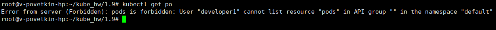

# Домашнее задание к занятию «Управление доступом»

## Задание 1. Создайте конфигурацию для подключения пользователя

1. Создайте и подпишите SSL-сертификат для подключения к кластеру.
2. Настройте конфигурационный файл kubectl для подключения.
3. Создайте роли и все необходимые настройки для пользователя.
4. Предусмотрите права пользователя. Пользователь может просматривать логи подов и их конфигурацию (kubectl logs pod <pod_id>, kubectl describe pod <pod_id>).
5. Предоставьте манифесты и скриншоты и/или вывод необходимых команд.

**Решение**

* Генерация закрытого ключа и запроса на сертификат

> openssl genrsa -out developer1.key 2048

> openssl req -new -key developer1.key -out developer1.csr -subj "/CN=developer1"

> cat developer1.csr | base64 | tr -d "\n"


```
cat <<EOF | kubectl apply -f -
apiVersion: certificates.k8s.io/v1
kind: CertificateSigningRequest
metadata:
  name: developer1
spec:
  request: LS0tLS1CRUdJTiBDRVJUSUZJQ0FURSBSRVFVRVNULS0tLS0KTUlJQ1dqQ0NBVUlDQVFBd0ZURVRNQkVHQTFVRUF3d0taR1YyWld4dmNHVnlNVENDQVNJd0RRWUpLb1pJaHZjTgpBUUVCQlFBRGdnRVBBRENDQVFvQ2dnRUJBSSsxbDhUTlF1YVd5S3I0bU5mcWxLQ3hYMXE1MUhzMjRhWTBsWW1oCnAwangwSjNZUXVUT1A1Yyt0N1liVVZmdmpjTDNsRGEyR1hkMjM4UWFJZXdvb0ZFakxteTNSd1MzeGFHUWxqNXMKRkxtbitaVDdOZnBvL3VFWitZWSt0NEE5NFVvSWN6TmtSWldYNGQySzE5SHlEbjFNTEZmMnRFUUJQbzFzcVRGLwo0Vm5zd3RGNjFjTmJjcWQwWGVYUVRCVFlWdVBKdXdhVXdKditPRzBYTkdFNFYybUxDWWN4bm1yMFV3aUZZREhoCnFCM2RpRnp2VHNvL3RjMktTak4vYld2ZDE1YWVFZ1daU2dLdUF1dlpRcjhXRkZKWVNSQlhXdWk4aWhueTJodVoKdGNpQngzU3FMRzZtRW1jRmhBSUxMYTMvWDRsZDNEN3E3ZStqRmVSUmJaY29rMk1DQXdFQUFhQUFNQTBHQ1NxRwpTSWIzRFFFQkN3VUFBNElCQVFCS3Y2dWZGeUphd3V3a3drbHlHWVNrWS9Qb2NIZXREMHRkWnpwSGlwSC9ZWHZrCm5YTEM1am5JS0ZZTk1Mbm9kQzdud1NvdDZldVk3R201Uk9HWXN6VzV1ZjU2K1JkU1BScVJrd1R0Vld4ejc5Q0YKTzlPS0Z6Q29MSldjVWhSbUR0OFlwVkxuN3dnMS83a3NWVGRRTW1udW5EbUFPZjM3Q2V3ZTNxU0ZGNDYrV1p2TwpoZzN5VTh4TUYxd2pOUytKVytyRzJqSHVuZ0JuV3dZck04QXZMQWpSTjZ5V2NCcnI4WUVOR0M1RnkrK3pVSUlkCmZ0OFZqcGtrWkZNbG95STBnVEN5QW4wOHFJdTYvYjlIcHVtTGdJSUduTnlubkJmQW9YV0hFVE1JRHpOaDdTNU8Ka0pjZ2xwVCt1R1RzeVBNNFlSV0pja2pGTUorVjhFNjNtNFROOHB0cwotLS0tLUVORCBDRVJUSUZJQ0FURSBSRVFVRVNULS0tLS0K
  signerName: kubernetes.io/kube-apiserver-client
  expirationSeconds: 86400  # one day
  usages:
  - client auth
EOF
```

* Выпуск сертификата

> kubectl get csr

> kubectl certificate approve developer1

> kubectl get csr/developer1 -o yaml

> kubectl get csr developer1 -o jsonpath='{.status.certificate}'| base64 -d > developer1.crt


* Добавление ключа и сертификата в kubeconfig

> kubectl config set-credentials developer1 --client-key=developer1.key --client-certificate=developer1.crt --embed-certs=true

> kubectl config set-context developer1 --cluster=microk8s-cluster --user=developer1

> kubectl config use-context developer1


* Создаем роль

> vi pod_ro.yaml

```YAML
apiVersion: rbac.authorization.k8s.io/v1
kind: Role
metadata:
  namespace: default
  name: pod-ro
rules:
- apiGroups: [""]
  resources: ["pods", "pods/log"]
  verbs: ["get", "list"]
```

> kubectl apply -f pod_ro.yaml

* Привязываем роль и пользователя

> vi pod_ro_bind.yaml

```YAML
apiVersion: rbac.authorization.k8s.io/v1
# This role binding allows "jane" to read pods in the "default" namespace.
# You need to already have a Role named "pod-reader" in that namespace.
kind: RoleBinding
metadata:
  name: read-pods
  namespace: default
subjects:
# You can specify more than one "subject"
- kind: User
  name: developer1 # "name" is case sensitive
  apiGroup: rbac.authorization.k8s.io
roleRef:
  # "roleRef" specifies the binding to a Role / ClusterRole
  kind: Role #this must be Role or ClusterRole
  name: pod-ro # this must match the name of the Role or ClusterRole you wish to bind to
  apiGroup: rbac.authorization.k8s.io
```

> kubectl apply -f pod_ro_bind.yaml


**Результат**

*kubectl get csr*


*kubectl get po* (Без присвоения роли)



*kubectl get po* (После присвоения роли)


*kubectl logs pods/...* (После присвоения роли)


*kubectl describe pod mt* (После присвоения роли)

