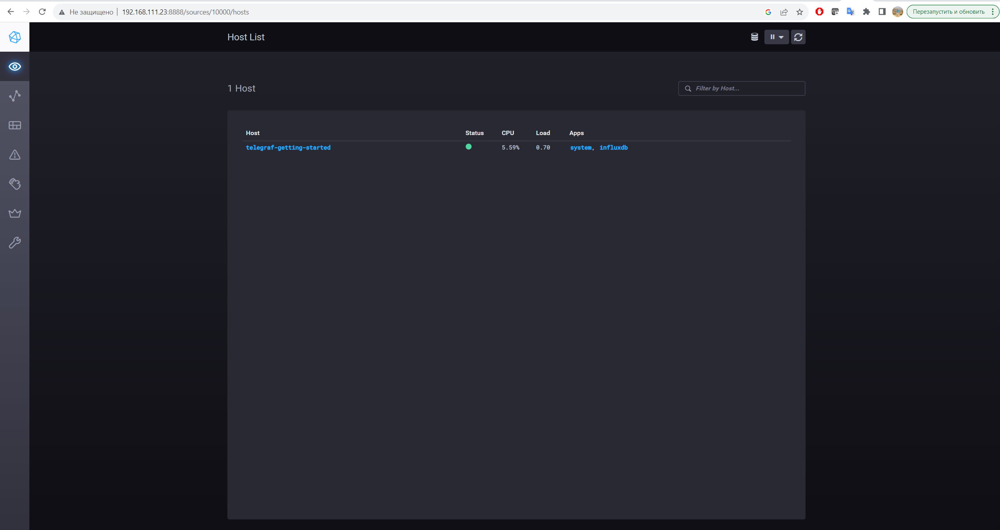
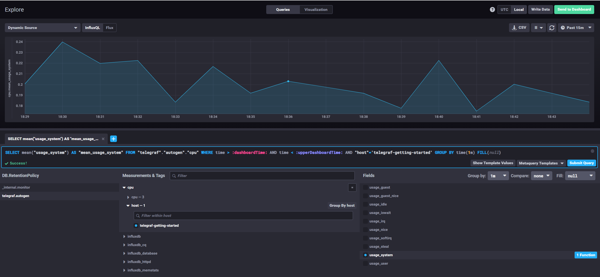
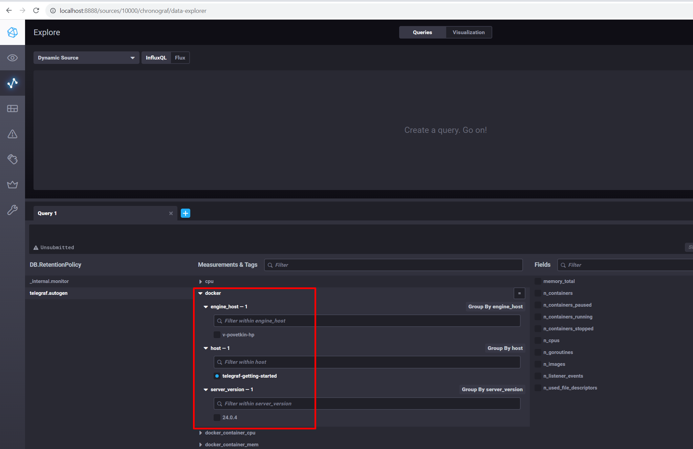

# Домашнее задание к занятию 13 «Введение в мониторинг»


## Обязательные задания

1. Вас пригласили настроить мониторинг на проект. На онбординге вам рассказали, что проект представляет из себя платформу для вычислений с выдачей текстовых отчётов, которые сохраняются на диск. Взаимодействие с платформой осуществляется по протоколу http. Также вам отметили, что вычисления загружают ЦПУ. Какой минимальный набор метрик вы выведите в мониторинг и почему?

> * CPU Load Average
> * Статусы HTTP запросов (200,300 и т.д)
> * Использование пространства где хранятся отчеты

2. Менеджер продукта, посмотрев на ваши метрики, сказал, что ему непонятно, что такое RAM/inodes/CPUla. Также он сказал, что хочет понимать, насколько мы выполняем свои обязанности перед клиентами и какое качество обслуживания. Что вы можете ему предложить?

> Я предложу ввести метрику **SLI**, которая будет индикатором качества предоставляемого сервиса.

3. Вашей DevOps-команде в этом году не выделили финансирование на построение системы сбора логов. Разработчики, в свою очередь, хотят видеть все ошибки, которые выдают их приложения. Какое решение вы можете предпринять в этой ситуации, чтобы разработчики получали ошибки приложения?

> Я бы предложил установить Open Source решение для перехвата ошибок **Sentry**.

4. Вы, как опытный SRE, сделали мониторинг, куда вывели отображения выполнения SLA = 99% по http-кодам ответов. Этот параметр вычисляется по формуле: summ_2xx_requests/summ_all_requests. Он не поднимается выше 70%, но при этом в вашей системе нет кодов ответа 5xx и 4xx. Где у вас ошибка?

> Не учтены http-коды 3xx. Формула должна выглядеть следующим образом
>
> SLI = (summ_2xx_requests + summ_3xx_requests) / (summ_all_requests)

5. Опишите основные плюсы и минусы pull и push систем мониторинга.

**PUSH, плюсы**

* Возможность отправки метрик в две и более системы мониторинга (Репликация)
* Обычно используется протокол UDP, меньше накладных расходов
* Лучше подходит для статической инфраструктуры

**PUSH, минусы**

* Сложнее настройка и отладка

**PULL, плюсы**

* Легче получать и отлаживать данные
* Лучше подходит для динамической инфраструктуры
* Централизованная конфигурация

**PULL, минусы**

* Не подходит для "мало-живущих" процессов (Short Lifecycle: JOB, Task ...)
* Тяжелее масштабировать

6. Какие из ниже перечисленных систем относятся к push модели, а какие к pull? А может есть гибридные?

* Prometheus - **pull**
* TICK - **push**
* Zabbix - **pull и push**
* VictoriaMetrics - **pull и push**
* Nagios - **push**


7. Склонируйте себе репозиторий и запустите TICK-стэк, используя технологии docker и docker-compose.

**Установка**

```
cd /tick
curl -SL https://github.com/docker/compose/releases/download/v2.23.0/docker-compose-linux-x86_64 -o /usr/local/bin/docker-compose
git clone https://github.com/influxdata/sandbox.git
cd sandbox
./sandbox up
```

**TICK UI**




8.Перейдите в веб-интерфейс Chronograf (http://localhost:8888) и откройте вкладку Data explorer.

Нажмите на кнопку Add a query
Изучите вывод интерфейса и выберите БД telegraf.autogen
В measurments выберите cpu->host->telegraf-getting-started, а в fields выберите usage_system. Внизу появится график утилизации cpu.
Вверху вы можете увидеть запрос, аналогичный SQL-синтаксису. Поэкспериментируйте с запросом, попробуйте изменить группировку и интервал наблюдений.
Для выполнения задания приведите скриншот с отображением метрик утилизации cpu из веб-интерфейса.

**График утилизации CPU**




9. Изучите список telegraf inputs. Добавьте в конфигурацию telegraf следующий плагин - docker:


**Docker метрики**




## Дополнительное задание* (со звёздочкой)

* **работающий код python3-скрипта**

[awesome_monitoring.py](./home_work/mon_01/awesome_monitoring.py)

* **конфигурацию cron-расписания**

```
* * * * * python3 /root/mon_hw/01/awesome_monitoring.py >/tmp/awesome_err.log 2>&1
```

* **пример верно сформированного 'YY-MM-DD-awesome-monitoring.log', имеющий не меньше пяти записей.**

[23-10-30-awesome-monitoring.log](./home_work/mon_01/23-10-30-awesome-monitoring.log)

