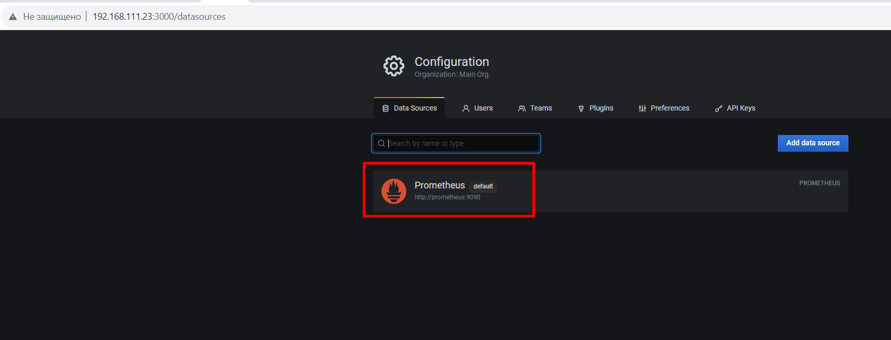
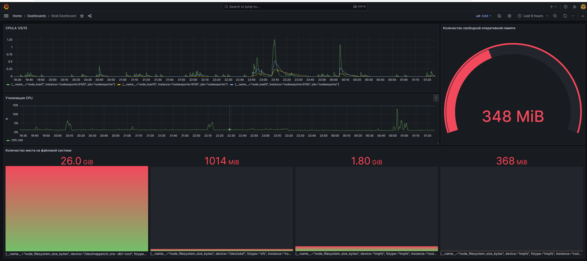
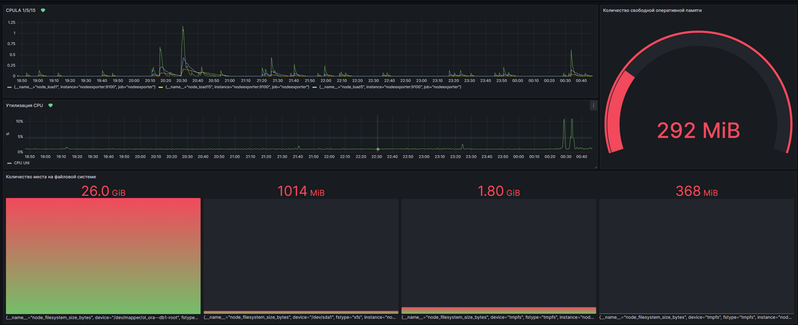

# Домашнее задание к занятию 14 «Средство визуализации Grafana»


## Обязательные задания

### Задание 1


Решение домашнего задания — скриншот веб-интерфейса grafana со списком подключенных Datasource.

* **Запуск стэка**

```
cd /prom
docker-compose up
```

* **Docker UI**




### Задание 2


Создайте Dashboard и в ней создайте Panels:

* утилизация CPU для nodeexporter (в процентах, 100-idle);

```
100 * (1 - avg(rate(node_cpu_seconds_total{mode="idle"}[$__rate_interval])))
```

* CPULA 1/5/15;

```
{__name__=~"node_load(1|5|15)"}
```

* количество свободной оперативной памяти;

```
node_memory_MemFree_bytes
```

* количество места на файловой системе.

```
node_filesystem_size_bytes
```

**Dashboard с панелями**




### Задание 3

1. Создайте для каждой Dashboard подходящее правило alert — можно обратиться к первой лекции в блоке «Мониторинг».


**Dashboard с правилами Alert-инга**




### Задание 4

1. Сохраните ваш Dashboard.Для этого перейдите в настройки Dashboard, выберите в боковом меню «JSON MODEL». Далее скопируйте отображаемое json-содержимое в отдельный файл и сохраните его.
2. В качестве решения задания приведите листинг этого файла.

**Мой Dashboard**

[my_grafana_dashboard.json](./home_work/mon_02/my_grafana_dashboard.json)

