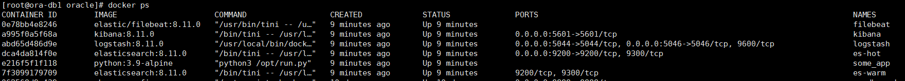
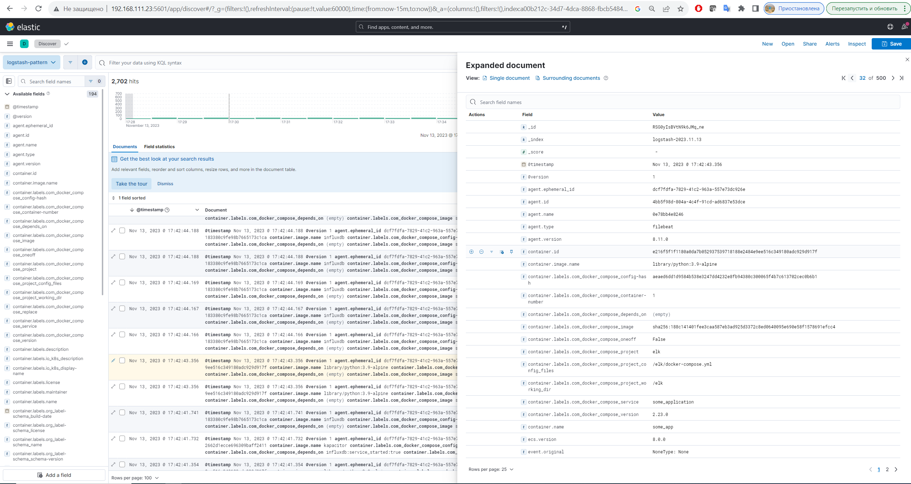
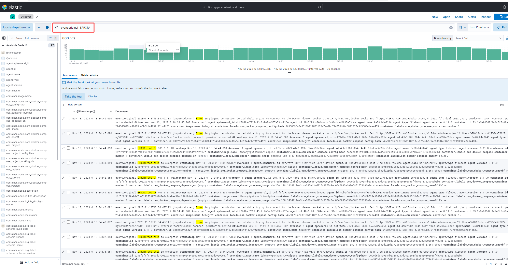

# Домашнее задание к занятию 15 «Система сбора логов Elastic Stack»


## Обязательные задания

### Задание 1

Вам необходимо поднять в докере и связать между собой:

elasticsearch (hot и warm ноды);
logstash;
kibana;
filebeat.

* **Запуск стэка**

```
cd /elk
docker-compose up
```


Результатом выполнения задания должны быть:

* скриншот docker ps через 5 минут после старта всех контейнеров (их должно быть 5);
* скриншот интерфейса kibana;
* docker-compose манифест (если вы не использовали директорию help);
* ваши yml-конфигурации для стека (если вы не использовали директорию help).


* **docker ps**




* **kibana UI**




### Задание 2

Перейдите в меню создания index-patterns в kibana и создайте несколько index-patterns из имеющихся.

Перейдите в меню просмотра логов в kibana (Discover) и самостоятельно изучите, как отображаются логи и как производить поиск по логам.


* **Поиск в Kibana**


