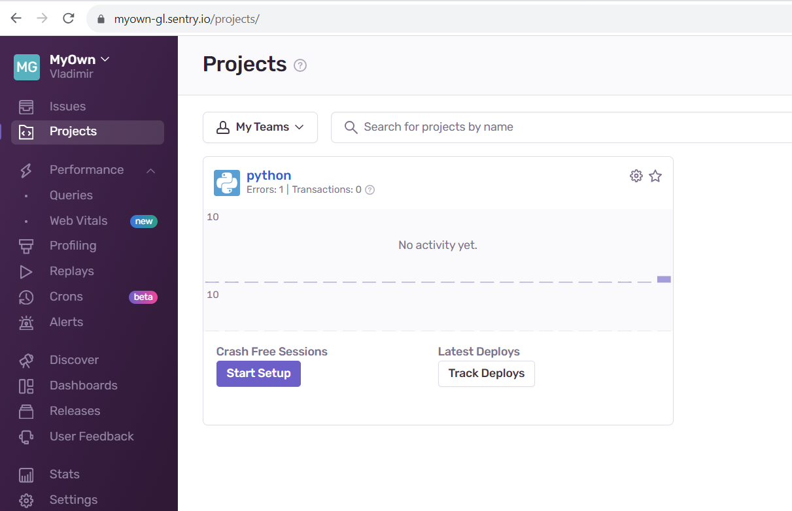
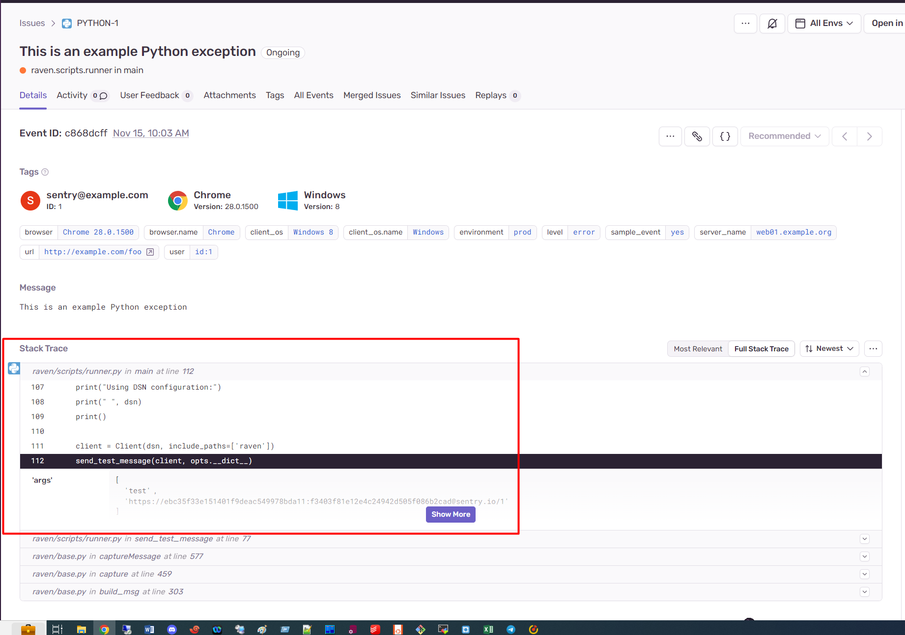
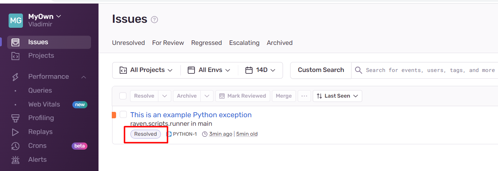
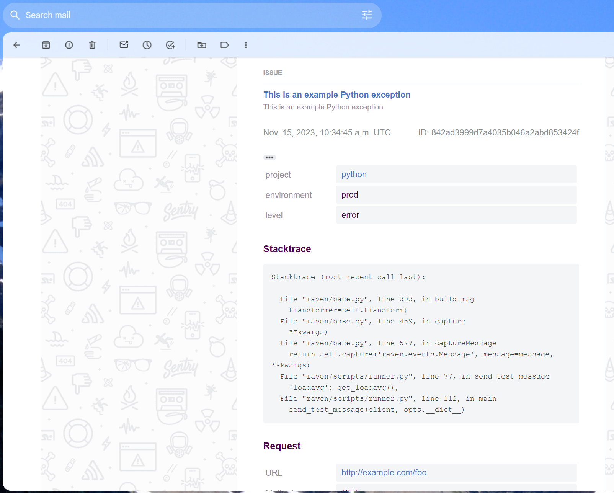
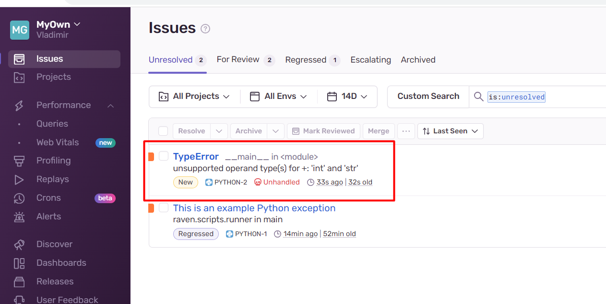

# Домашнее задание к занятию 16 «Платформа мониторинга Sentry»


## Задание 1

В качестве решения задания пришлите скриншот меню Projects.

* **Sentry Projects**




## Задание 2

1. Создайте python-проект и нажмите Generate sample event для генерации тестового события.
2. Изучите информацию, представленную в событии.
3. Перейдите в список событий проекта, выберите созданное вами и нажмите Resolved.
4. В качестве решения задание предоставьте скриншот Stack trace из этого события и список событий проекта после нажатия Resolved.

* **Stack trace**




* **Issues**




## Задание 3

В качестве решения задания пришлите скриншот тела сообщения из оповещения на почте.


* **Сообщение в почте**




## Задание повышенной сложности

1. Создайте проект на ЯП Python или GO (около 10–20 строк), подключите к нему sentry SDK и отправьте несколько тестовых событий.
2. Поэкспериментируйте с различными передаваемыми параметрами, но помните об ограничениях Free учётной записи Cloud Sentry.
3. В качестве решения задания пришлите скриншот меню issues вашего проекта и пример кода подключения sentry sdk/отсылки событий.


* **Sentry Issues**




* **Код приложения**

```python
import sentry_sdk

sentry_sdk.init(
    dsn="https://<name>.ingest.sentry.io/<id>",
    # Set traces_sample_rate to 1.0 to capture 100%
    # of transactions for performance monitoring.
    traces_sample_rate=0.1,
    # Set profiles_sample_rate to 1.0 to profile 100%
    # of sampled transactions.
    # We recommend adjusting this value in production.
    profiles_sample_rate=0.1,
)

if __name__ == "__main__":
	
	bad_addition = 2 + '2'
```