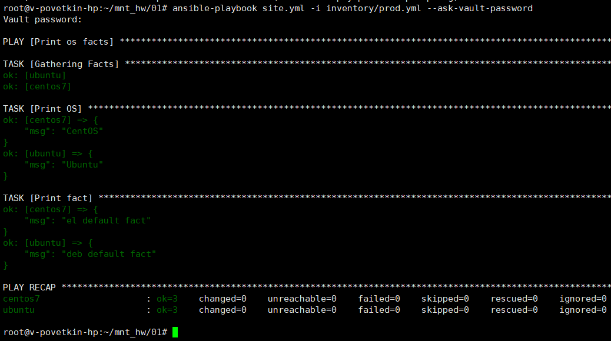
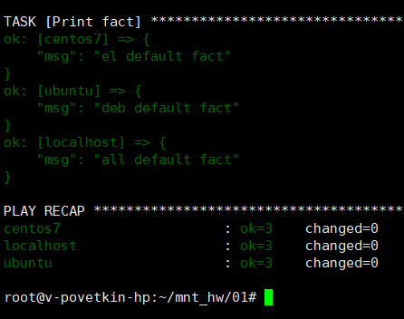

# Домашнее задание к занятию 1 «Введение в Ansible»

[Ссылка на исходный код ansible](./home_work/mnt_01/)

## Основная часть

1. Попробуйте запустить playbook на окружении из test.yml, зафиксируйте значение, которое имеет факт some_fact для указанного хоста при выполнении playbook.

> ansible-playbook site.yml -i inventory/test.yml

```
TASK [Print fact] **********************************************************************************************************************************************************************************
ok: [localhost] => {
    "msg": 12
}
```


2. Найдите файл с переменными (group_vars), в котором задаётся найденное в первом пункте значение, и поменяйте его на all default fact.

* group_vars/all/examp.yml

```YAML
---
  some_fact: "all default fact"
```


3. Воспользуйтесь подготовленным (используется docker) или создайте собственное окружение для проведения дальнейших испытаний.

```
docker run -dit --name centos7 pycontribs/centos:7 sleep 6000000
docker run -dit --name ubuntu pycontribs/ubuntu:latest sleep 6000000
```


4. Проведите запуск playbook на окружении из prod.yml. Зафиксируйте полученные значения some_fact для каждого из managed host.

> ansible-playbook site.yml -i inventory/prod.yml

*Результат:*


5. Добавьте факты в group_vars каждой из групп хостов так, чтобы для some_fact получились значения: для deb — deb default fact, для el — el default fact.

* [Ссылка на исходный код group_vars/deb](./home_work/mnt_01/group_vars/deb/examp.yml)

* [Ссылка на исходный код group_vars/el](./home_work/mnt_01/group_vars/el/examp.yml)

6. Повторите запуск playbook на окружении prod.yml. Убедитесь, что выдаются корректные значения для всех хостов.

*Результат:*


7. При помощи ansible-vault зашифруйте факты в group_vars/deb и group_vars/el с паролем netology.

```
ansible-vault encrypt group_vars/deb/examp.yml
ansible-vault encrypt group_vars/el/examp.yml
```
8. Запустите playbook на окружении prod.yml. При запуске ansible должен запросить у вас пароль. Убедитесь в работоспособности.

> ansible-playbook site.yml -i inventory/prod.yml --ask-vault-password

*Результат:*


9. Посмотрите при помощи ansible-doc список плагинов для подключения. Выберите подходящий для работы на control node.

10. В prod.yml добавьте новую группу хостов с именем local, в ней разместите localhost с необходимым типом подключения.

11. Запустите playbook на окружении prod.yml. При запуске ansible должен запросить у вас пароль. Убедитесь, что факты some_fact для каждого из хостов определены из верных group_vars.

*Результат:*


12. Заполните README.md ответами на вопросы. Сделайте git push в ветку master. В ответе отправьте ссылку на ваш открытый репозиторий с изменённым playbook и заполненным README.md.


