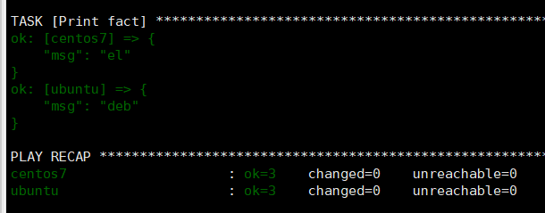
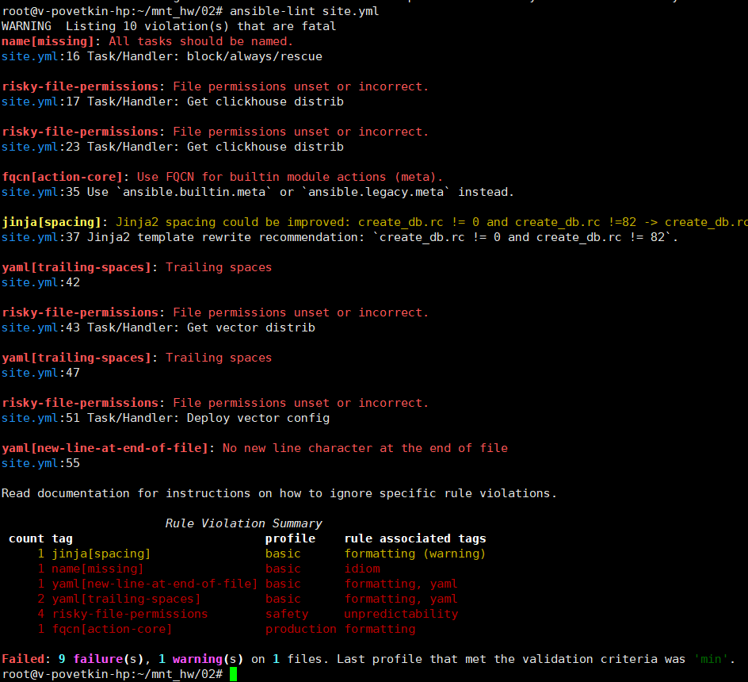
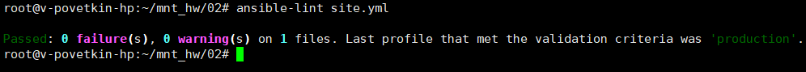
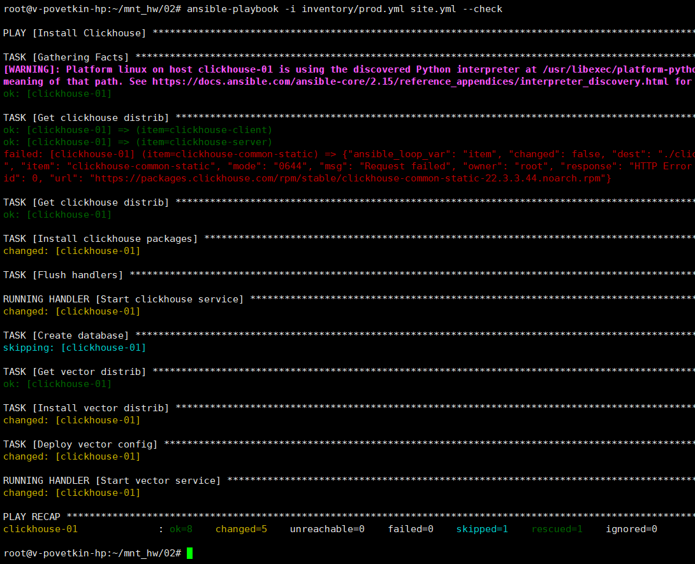
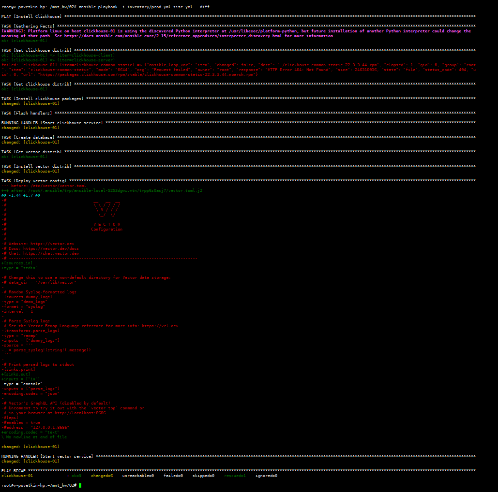
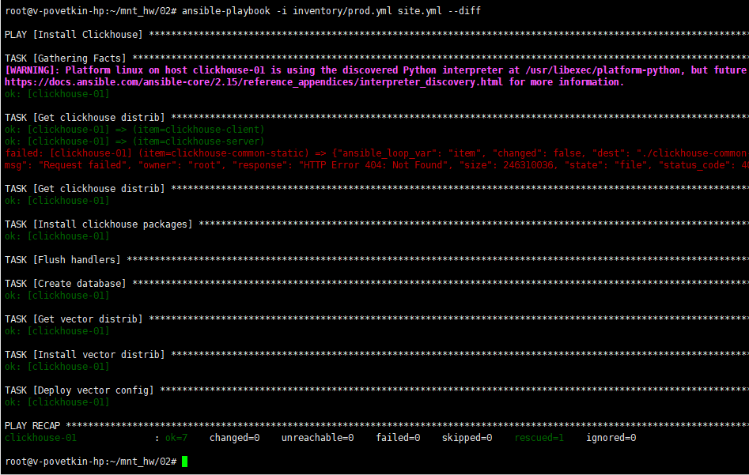

# Домашнее задание к занятию 2 «Работа с Playbook»

[Ссылка на исходный код ansible](./home_work/mnt_02/)

*Результат:*

## Основная часть

1. Подготовьте свой inventory-файл prod.yml.

2. Допишите playbook: нужно сделать ещё один play, который устанавливает и настраивает vector. Конфигурация vector должна деплоиться через template файл jinja2.

[Ссылка на vector.toml.j2](./home_work/mnt_02/templates/vector.toml.j2)

3. При создании tasks рекомендую использовать модули: get_url, template, unarchive, file.

4. Tasks должны: скачать дистрибутив нужной версии, выполнить распаковку в выбранную директорию, установить vector.

5. Запустите ansible-lint site.yml и исправьте ошибки, если они есть.

*Было:*

*Стало:*

6. Попробуйте запустить playbook на этом окружении с флагом --check.

> ansible-playbook -i inventory/prod.yml site.yml --check

*Вывод:*

7. Запустите playbook на prod.yml окружении с флагом --diff. Убедитесь, что изменения на системе произведены.

> ansible-playbook -i inventory/prod.yml site.yml --diff

*Вывод:*

8. Повторно запустите playbook с флагом --diff и убедитесь, что playbook идемпотентен.

> ansible-playbook -i inventory/prod.yml site.yml --diff

*Вывод:*

9. Подготовьте README.md-файл по своему playbook. В нём должно быть описано: что делает playbook, какие у него есть параметры и теги. Пример качественной документации ansible playbook по ссылке.

10. Готовый playbook выложите в свой репозиторий, поставьте тег 08-ansible-02-playbook на фиксирующий коммит, в ответ предоставьте ссылку на него.

[Ссылка на site.yml](./home_work/mnt_02/site.yml)

