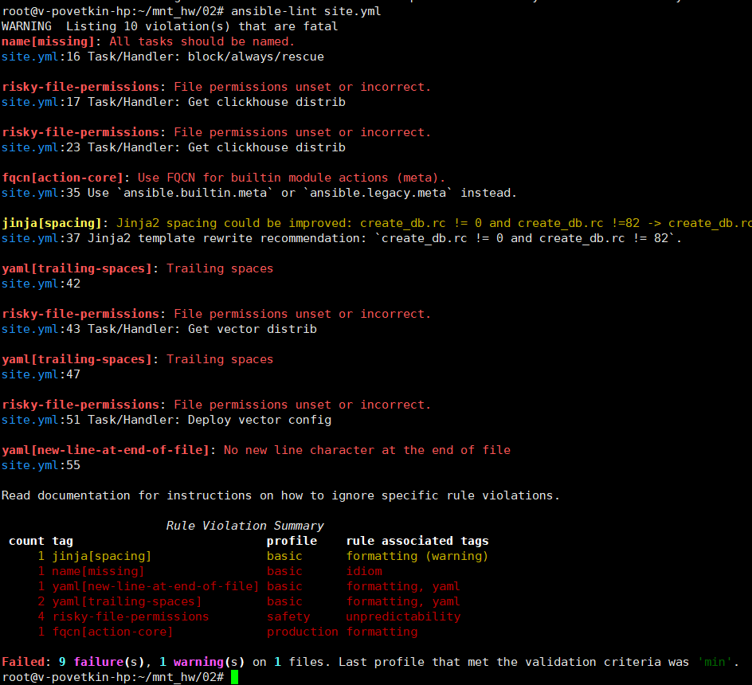
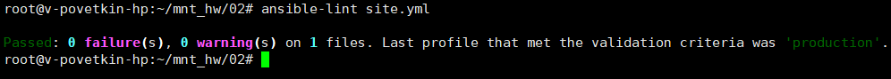
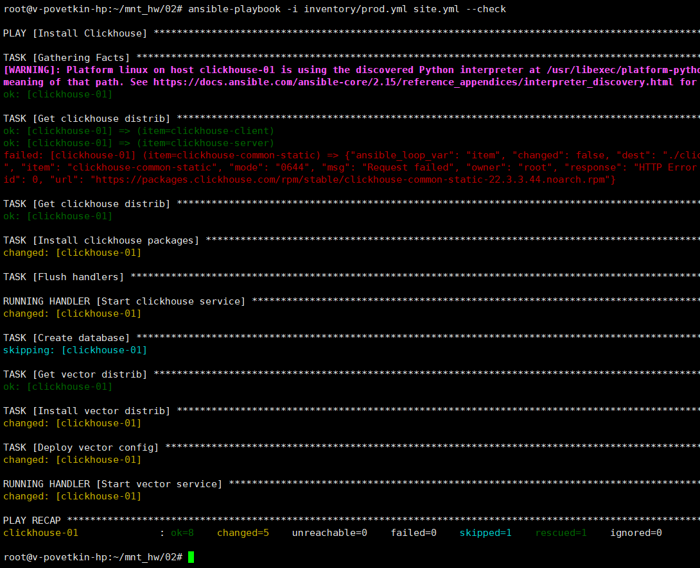
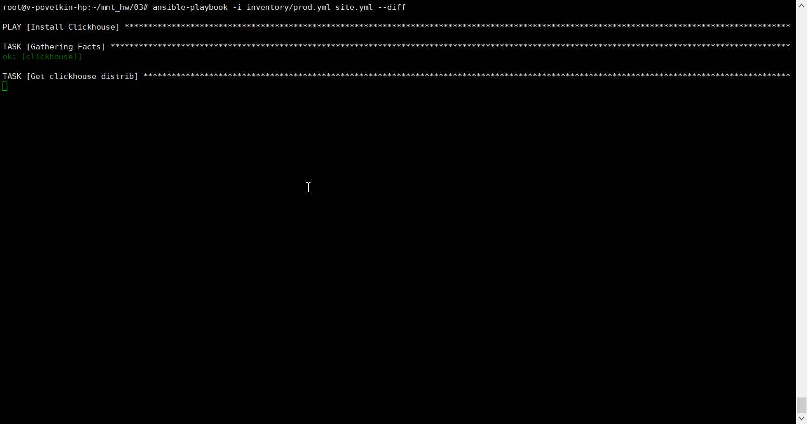
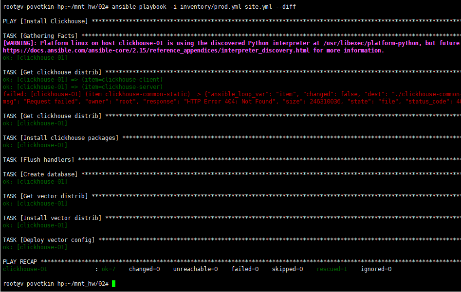

# Домашнее задание к занятию 3 «Использование Ansible»

[Ссылка на исходный код ansible](./home_work/mnt_02/)

[Ссылка на vector.toml.j2](./home_work/mnt_02/templates/vector.toml.j2)

## Основная часть

1. Допишите playbook: нужно сделать ещё один play, который устанавливает и настраивает LightHouse.
2. При создании tasks рекомендую использовать модули: get_url, template, yum, apt.
3. Tasks должны: скачать статику LightHouse, установить Nginx или любой другой веб-сервер, настроить его конфиг для открытия LightHouse, запустить веб-сервер.

*Решение*: [Ссылка на site.yml](./home_work/mnt_03/site.yml#L68-98)

4. Подготовьте свой inventory-файл prod.yml.

*Решение*: [Ссылка на prod.yml](./home_work/mnt_03/inventory/prod.yml)

5. Запустите ansible-lint site.yml и исправьте ошибки, если они есть.

*Было:*

*Стало:*

6. Попробуйте запустить playbook на этом окружении с флагом --check.

> ansible-playbook -i inventory/prod.yml site.yml --check

В моем случае check не проходит. Валится на превой ошибке

*Результат*: 

7. Запустите playbook на prod.yml окружении с флагом --diff. Убедитесь, что изменения на системе произведены.

*Результат*: 

8. Повторно запустите playbook с флагом --diff и убедитесь, что playbook идемпотентен.

*Результат*: 

9. Подготовьте README.md-файл по своему playbook. В нём должно быть описано: что делает playbook, какие у него есть параметры и теги.

*Ответ*: [Readme для playbook-а](./home_work/mnt_03/README.md)

10. Готовый playbook выложите в свой репозиторий, поставьте тег 08-ansible-03-yandex на фиксирующий коммит, в ответ предоставьте ссылку на него.