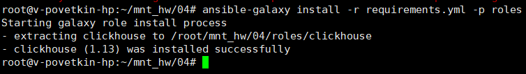
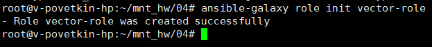

# Домашнее задание к занятию 4 «Работа с roles»

[Ссылка на исходный код ansible](./home_work/mnt_03/)

Ваша цель — разбить ваш playbook на отдельные roles.

Задача — сделать roles для ClickHouse, Vector и LightHouse и написать playbook для использования этих ролей.

Ожидаемый результат — существуют три ваших репозитория: два с roles и один с playbook.

Что нужно сделать

1. Создайте в старой версии playbook файл requirements.yml и заполните его содержимым:

```YML
---
  - src: https://github.com/AlexeySetevoi/ansible-clickhouse.git
    scm: git
    version: "1.13"
    name: clickhouse 
```

2. При помощи ansible-galaxy скачайте себе эту роль.

> ansible-galaxy install -r requirements.yml -p roles

*Результат*: 

3. Создайте новый каталог с ролью при помощи ansible-galaxy role init vector-role.

> ansible-galaxy role init vector-role

*Результат*: 

4. На основе tasks из старого playbook заполните новую role. Разнесите переменные между vars и default.

5. Перенести нужные шаблоны конфигов в templates.

6. Опишите в README.md обе роли и их параметры. Пример качественной документации ansible role по ссылке.

7. Повторите шаги 3–6 для LightHouse. Помните, что одна роль должна настраивать один продукт.

8. Выложите все roles в репозитории. Проставьте теги, используя семантическую нумерацию. Добавьте roles в requirements.yml в playbook.

9. Переработайте playbook на использование roles. Не забудьте про зависимости LightHouse и возможности совмещения roles с tasks.

10. Выложите playbook в репозиторий.

11. В ответе дайте ссылки на оба репозитория с roles и одну ссылку на репозиторий с playbook.

*Роли*

* [vector-role](https://github.com/bova/vector-role.git)

* [lighthouse-role](https://github.com/bova/lighthouse-role.git)

*Playbook*

* [Playbook](./home_work/mnt_04/)