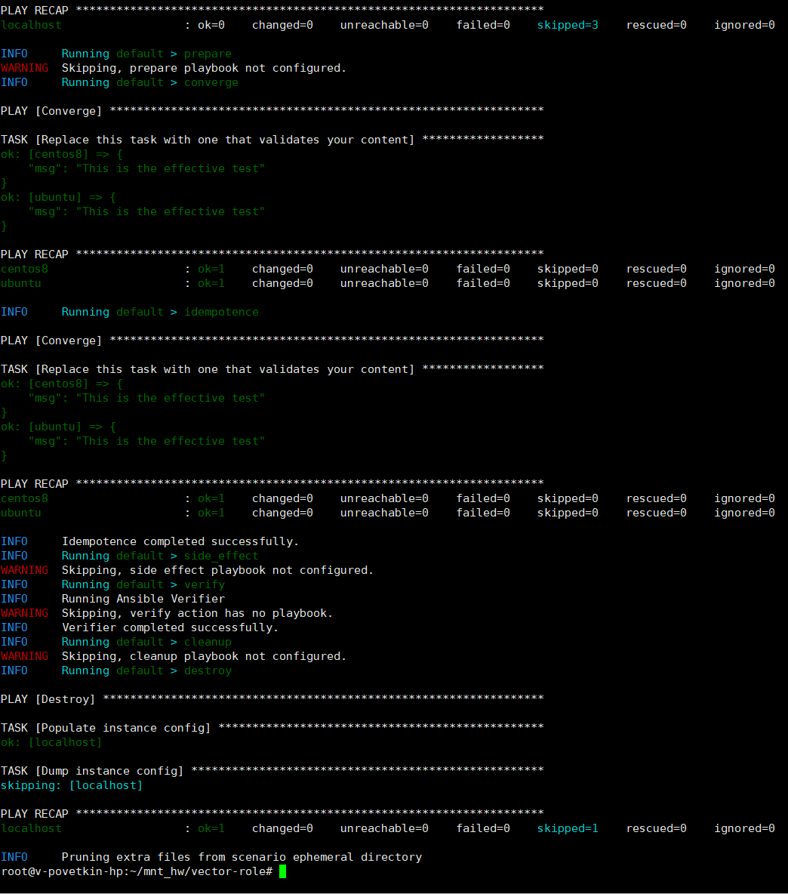
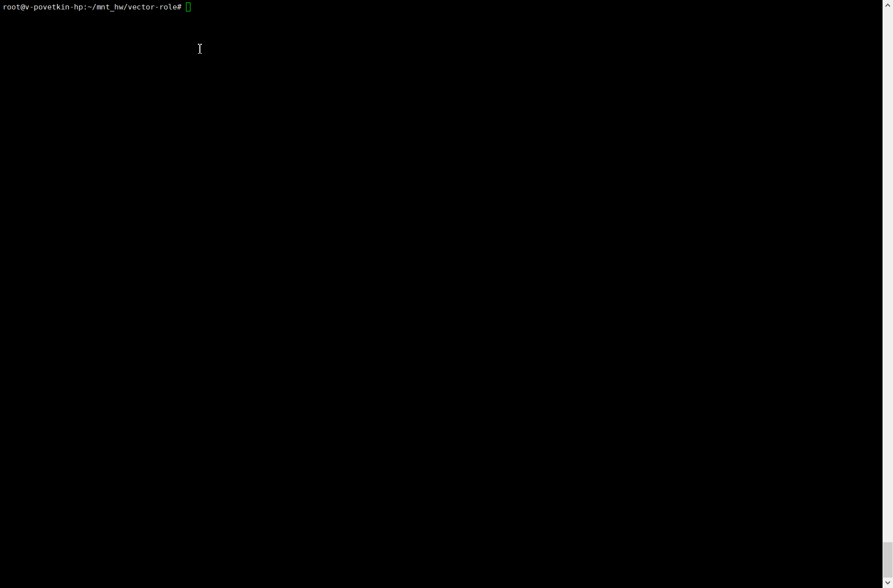
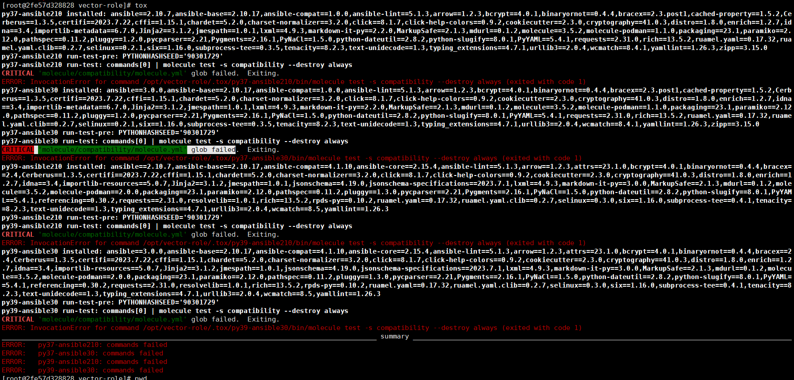
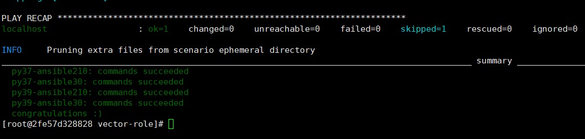
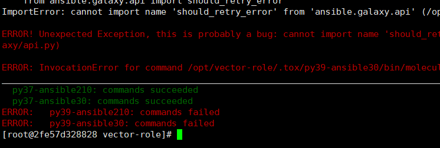

# Домашнее задание к занятию 5 «Тестирование roles»


## Molecule

1. Запустите molecule test -s centos_7 внутри корневой директории clickhouse-role, посмотрите на вывод команды. Данная команда может отработать с ошибками, это нормально. Наша цель - посмотреть как другие в реальном мире используют молекулу.

* **Выполнено**

2. Перейдите в каталог с ролью vector-role и создайте сценарий тестирования по умолчанию при помощи molecule init scenario --driver-name docker.


> molecule init scenario --driver-name docker


3. Добавьте несколько разных дистрибутивов (centos:8, ubuntu:latest) для инстансов и протестируйте роль, исправьте найденные ошибки, если они есть.

> molecule test

*Результат*: 


4. Добавьте несколько assert в verify.yml-файл для проверки работоспособности vector-role (проверка, что конфиг валидный, проверка успешности запуска и др.).

* Добавлены следующие проверки

```yml
  - name: "vector-role"
    include_role:
      name: "vector-role"
	  
  - name: "vector - check Vector package status"
    package:
      name: "vector.x86_64"
      state: "installed"
    check_mode: yes
    register: pkg_status

  - name: "vector - test vector package is installed"
    assert:
      that:
        - not pkg_status.changed    
```		

5. Запустите тестирование роли повторно и проверьте, что оно прошло успешно.

* Создание контейнера для тестирования:

> docker run --name centos7 -it pycontribs/centos:7 /bin/bash


*Результат теста*: 


6. Добавьте новый тег на коммит с рабочим сценарием в соответствии с семантическим версионированием.

* [Vector role c molecule](https://github.com/bova/vector-role/tree/1.2.0)


### Tox

1. Добавьте в директорию с vector-role файлы из директории.
2. Запустите docker run --privileged=True -v <path_to_repo>:/opt/vector-role -w /opt/vector-role -it aragast/netology:latest /bin/bash, где path_to_repo — путь до корня репозитория с vector-role на вашей файловой системе.

> docker run --privileged=True -v /root/mnt_hw/vector-role:/opt/vector-role -w /opt/vector-role -it aragast/netology:latest /bin/bash

3. Внутри контейнера выполните команду tox, посмотрите на вывод.

> tox

* Получил ошибку: 

```
CRITICAL 'molecule/compatibility/molecule.yml' glob failed.  Exiting.
ERROR: InvocationError for command /opt/vector-role/.tox/py37-ansible30/bin/molecule test -s compatibility --destroy always (exited with code 1)
```

*Результат*: 

4. Создайте облегчённый сценарий для molecule с драйвером molecule_podman. Проверьте его на исполнимость.

```
molecule init scenario -d podman scenario2
molecule test -s scenario2
```

5. Пропишите правильную команду в tox.ini, чтобы запускался облегчённый сценарий.

```
commands =
    {posargs:molecule test -s scenario2 --destroy always}
```

6. Запустите команду tox. Убедитесь, что всё отработало успешно.

**Предварительное создание контейнера:**

> podman run -dit --name centos7 pycontribs/centos:7 sleep 6000000

**Запуск tox**

> tox

**Результат:**



**Результат при работе с реальным контейнером centos7:** 




7. Добавьте новый тег на коммит с рабочим сценарием в соответствии с семантическим версионированием.

* [Vector role c TOX](https://github.com/bova/vector-role/tree/1.3.0)

