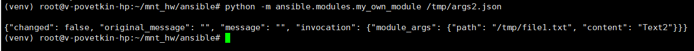
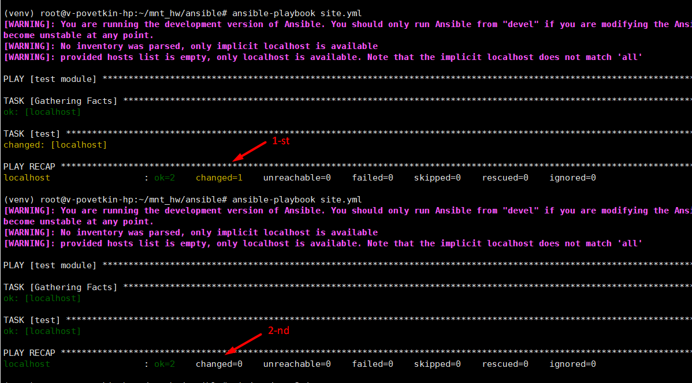
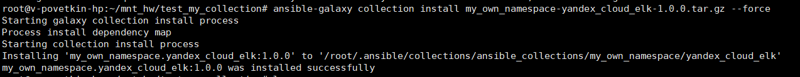
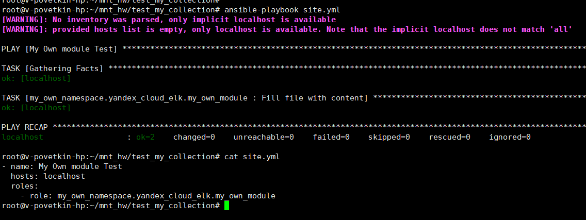

# Домашнее задание к занятию 6 «Создание собственных модулей»

## Основная часть


Ваша цель — написать собственный module, который вы можете использовать в своей role через playbook. Всё это должно быть собрано в виде collection и отправлено в ваш репозиторий.

Шаг 1. В виртуальном окружении создайте новый my_own_module.py файл.

Шаг 2. Наполните его содержимым:

Шаг 3. Заполните файл в соответствии с требованиями Ansible так, чтобы он выполнял основную задачу: module должен создавать текстовый файл на удалённом хосте по пути, определённом в параметре path, с содержимым, определённым в параметре content.

```Python
    if os.path.isfile(module.params['path']):
        file_hash_before = hash_file(module.params['path'])
    else:
	    file_hash_before = 0
	# Create file	
    with open(module.params['path'], 'w') as f:
        f.write(module.params['content'])
		
    file_hash_after =  hash_file(module.params['path'])
```

Шаг 4. Проверьте module на исполняемость локально.

>  python -m ansible.modules.my_own_module /tmp/args2.json

*Результат*: 


Шаг 5. Напишите single task playbook и используйте module в нём.

```YML
---
# My own module
- name: test module
  hosts: localhost
  tasks:
  - name: test
    my_own_module:
      path: '/tmp/file2'
      content: 'text file v3'
```


Шаг 6. Проверьте через playbook на идемпотентность.

>  ansible-playbook site.yml
>
>  ansible-playbook site.yml

*Результат*: 

Шаг 7. Выйдите из виртуального окружения.

Шаг 8. Инициализируйте новую collection: ansible-galaxy collection init my_own_namespace.yandex_cloud_elk.

> cd /root/mnt_hw/
>
> ansible-galaxy collection init my_own_namespace.yandex_cloud_elk

Шаг 9. В эту collection перенесите свой module в соответствующую директорию.

> cp /root/mnt_hw/ansible/lib/ansible/modules/my_own_module.py /root/mnt_hw/my_own_namespace/yandex_cloud_elk/plugins/modules/

Шаг 10. Single task playbook преобразуйте в single task role и перенесите в collection. У role должны быть default всех параметров module.

> cd /root/mnt_hw/my_own_namespace/yandex_cloud_elk
>
> ansible-galaxy role init my_own_module --init-path roles/
>
> molecule init scenario

* Defaults/main.yml

```YML
---
path: "/tmp/file1.txt"
content: "File content"
```

* tasks/main.yml

```YML
---
# My own module
- name: Fill file with content
  my_own_module:
    path: "{{ path }}"
    content: "{{ content }}"
```

> molecule test

Шаг 11. Создайте playbook для использования этой role.

Шаг 12. Заполните всю документацию по collection, выложите в свой репозиторий, поставьте тег 1.0.0 на этот коммит.

Шаг 13. Создайте .tar.gz этой collection: ansible-galaxy collection build в корневой директории collection.

> cd ~/mnt_hw/my_own_namespace/yandex_cloud_elk
>
> ansible-galaxy collection build

Шаг 14. Создайте ещё одну директорию любого наименования, перенесите туда single task playbook и архив c collection.

> mkdir ~/mnt_hw/test_my_collection
>
> cd ~/test_my_collection/
>
> cp ~/mnt_hw/my_own_namespace/yandex_cloud_elk/my_own_namespace-yandex_cloud_elk-1.0.0.tar.gz ~/mnt_hw/test_my_collection/

* Playbook: site.yml

```YML
- name: My Own module Test
  hosts: localhost
  roles:
    - role: my_own_namespace.yandex_cloud_elk.my_own_module

```

Шаг 15. Установите collection из локального архива: ansible-galaxy collection install <archivename>.tar.gz.

> cd ~/mnt_hw/test_my_collection/
>
> ansible-galaxy collection install my_own_namespace-yandex_cloud_elk-1.0.0.tar.gz --force

*Результат*: 

Шаг 16. Запустите playbook, убедитесь, что он работает.

> ansible-playbook site.yml

*Результат*: 

Шаг 17. В ответ необходимо прислать ссылки на collection и tar.gz архив, а также скриншоты выполнения пунктов 4, 6, 15 и 16.

* **Архив коллекции**: [arch_coll](./home_work/mnt_06/my_own_namespace-yandex_cloud_elk-1.0.0.tar.gz)
* **Репозиторий с коллекцией**: https://github.com/bova/my_own_collection/tree/1.0.0
