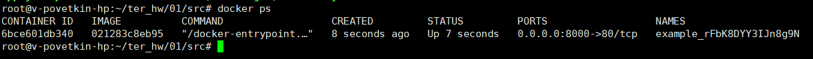
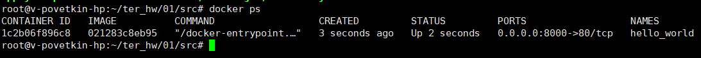
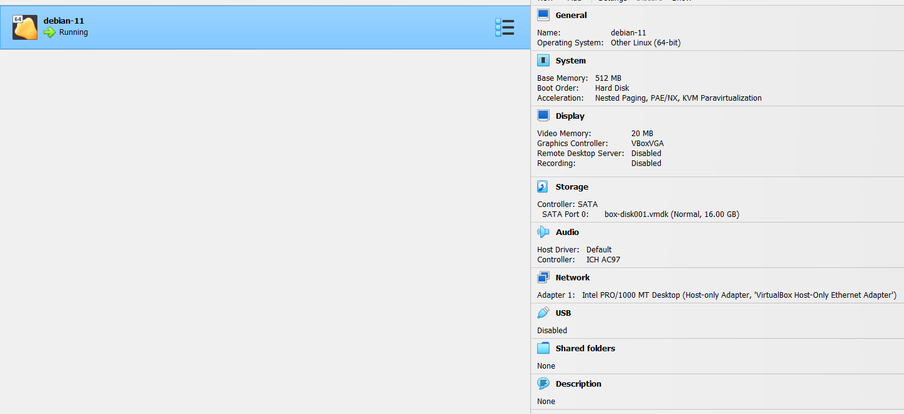

# Домашнее задание к занятию «Введение в Terraform»

## Задание 1


2. **Изучите файл .gitignore. В каком terraform файле согласно этому .gitignore допустимо сохранить личную, секретную информацию?**

В файле personal.auto.tfvars

3. **Выполните код проекта. Найдите в State-файле секретное содержимое созданного ресурса random_password, пришлите в качестве ответа конкретный ключ и его значение.**

Сгенерированный пароль из файла terraform.tfstate 

"result": "rFbK8DYY3IJn8g9N"


4. **Раскомментируйте блок кода, примерно расположенный на строчках 29-42 файла main.tf. Выполните команду terraform validate. Объясните в чем заключаются намеренно допущенные ошибки? Исправьте их.**

* Ошибка 1 (строка 24)

```
resource "docker_image" {
  name         = "nginx:latest"
  keep_locally = true
}
```

Нехватает уникального имени ресурса 


```
resource "docker_image" "nginx" {
  name         = "nginx:latest"
  keep_locally = true
}
```

* Ошибка 2 (строка 29), Ошбика 3 (строка 31)

```
resource "docker_container" "1nginx" {
  image = docker_image.nginx.image_id
  name  = "example_${random_password.random_string_FAKE.resulT}"
...
```

Имя ресурса должно начинаться с буквы или символа нижнего подчеркивания

Опечатка в строке 31

```
${random_password.random_string_FAKE.resulT} -> ${random_password.random_string.result}
```

5. **Выполните код. В качестве ответа приложите вывод команды docker ps**




6. **Замените имя docker-контейнера в блоке кода на hello_world, выполните команду terraform apply -auto-approve. Объясните своими словами, в чем может быть опасность применения ключа -auto-approve ? В качестве ответа дополнительно приложите вывод команды docker ps**

При использовании опции **-auto-approve** план применяется автоматически, пропуская вопрос о подтверждении




7. **Уничтожьте созданные ресурсы с помощью terraform. Убедитесь, что все ресурсы удалены. Приложите содержимое файла terraform.tfstate.**

Содержимое файла terraform.tfstate

```
{
  "version": 4,
  "terraform_version": "1.5.3",
  "serial": 11,
  "lineage": "1ce29aa4-7132-fe30-a608-bbe5f035e16b",
  "outputs": {},
  "resources": [],
  "check_results": null
}
```

8. **Объясните, почему при этом не был удален docker образ nginx:latest ? Ответ подкрепите выдержкой из документации провайдера.**

Для ресурса docker_image существует следующий аттрибут

```
"keep_locally": true
```

Выдержка из документации провайдера

> keep_locally (Boolean) If true, then the Docker image won't be deleted on destroy operation. If this is false, it will delete the image from the docker local storage on destroy operation.


# Задание 2*

Изучите в документации provider Virtualbox от shekeriev.
Создайте с его помощью любую виртуальную машину. Чтобы не использовать VPN советуем выбрать любой образ с расположением в github из списка
В качестве ответа приложите plan для создаваемого ресурса и скриншот созданного в VB ресурса.

**Ответ:**

```
Terraform used the selected providers to generate the following execution plan. Resource actions are indicated with the
following symbols:
  + create

Terraform will perform the following actions:

  # virtualbox_vm.vm1 will be created
  + resource "virtualbox_vm" "vm1" {
      + cpus   = 1
      + id     = (known after apply)
      + image  = "https://app.vagrantup.com/ubuntu/boxes/xenial64/versions/20190507.0.0/providers/virtualbox.box"
      + memory = "512 mib"
      + name   = "debian-11"
      + status = "running"

      + network_adapter {
          + device                 = "IntelPro1000MTDesktop"
          + host_interface         = "VirtualBox Host-Only Ethernet Adapter"
          + ipv4_address           = (known after apply)
          + ipv4_address_available = (known after apply)
          + mac_address            = (known after apply)
          + status                 = (known after apply)
          + type                   = "hostonly"
        }
    }

Plan: 1 to add, 0 to change, 0 to destroy.

Changes to Outputs:
  + IPAddress = (known after apply)
```

