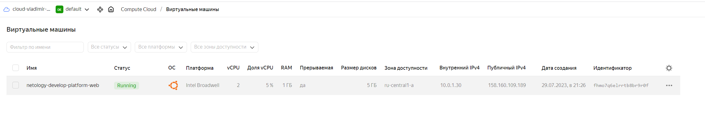

# Домашнее задание к занятию «Основы Terraform. Yandex Cloud»

[Ссылка на исходный код main.tf](./home_work/ter_02/src/main.tf#L10)

## Задание 1

4. **Инициализируйте проект, выполните код. Исправьте намеренно допущенные синтаксические ошибки. Ищите внимательно, посимвольно. Ответьте, в чём заключается их суть.**

main.tf:17

> platform_id = "standar**t**-v4" -> platform_id = "standar**d**-v1" 

нет платформы с именем standart-v4


5. **Ответьте, как в процессе обучения могут пригодиться параметры preemptible = true и core_fraction=5 в параметрах ВМ. Ответ в документации Yandex Cloud.**

Оба параметра призваны сэкономить расходы на ВМ

preemptible = true - машина выключиться через 22-24 часа после запуска. Машина выключиться при нехватке ресурсов обычным ВМ.
core_fraction=5 - минимально возможный процент процессорного времени (Performance level) при создании ВМ. 


Решение: 

*скриншот ЛК Yandex Cloud с созданной ВМ;*


*скриншот успешного подключения к консоли ВМ через ssh. К OS ubuntu необходимо подключаться под пользователем ubuntu: "ssh ubuntu@vm_ip_address";*


## Задание 2

Изучите файлы проекта.
Замените все хардкод-значения для ресурсов yandex_compute_image и yandex_compute_instance на отдельные переменные. К названиям переменных ВМ добавьте в начало префикс vm_web_ . Пример: vm_web_name.
Объявите нужные переменные в файле variables.tf, обязательно указывайте тип переменной. Заполните их default прежними значениями из main.tf.
Проверьте terraform plan. Изменений быть не должно.

* Решение

```
variable "vm_web_image_family" {
  type = string
  default = "ubuntu-2004-lts"
}

variable "vm_web_instance_name" {
  type = string
  default = "netology-develop-platform-web"
}

variable "vm_web_instance_platform" {
  type = string
  default = "standard-v1"
}

variable "vm_web_instance_cores" {
  type = number
  default = 2
}

variable "vm_web_instance_memory" {
  type = number
  default = 1
}

variable "vm_web_instance_cf" {
  type = number
  default = 5
}

```

* Результат: 

> No changes. Your infrastructure matches the configuration.


## Задание 3

Создайте в корне проекта файл 'vms_platform.tf' . Перенесите в него все переменные первой ВМ.
Скопируйте блок ресурса и создайте с его помощью вторую ВМ в файле main.tf: "netology-develop-platform-db" , cores = 2, memory = 2, core_fraction = 20. Объявите её переменные с префиксом vm_db_ в том же файле ('vms_platform.tf').
Примените изменения.

* Решение

* *vms_platform.tf*

```
###vm db
variable "vm_db_image_family" {
  type = string
  default = "ubuntu-2004-lts"
}

variable "vm_db_instance_name" {
  type = string
  default = "netology-develop-platform-db"
}

variable "vm_db_instance_platform" {
  type = string
  default = "standard-v1"
}

variable "vm_db_instance_cores" {
  type = number
  default = 2
}

variable "vm_db_instance_memory" {
  type = number
  default = 2
}

variable "vm_db_instance_cf" {
  type = number
  default = 20
}
```

* *main.tf*
```
### DB
resource "yandex_compute_instance" "platform_db" {
  name        = var.vm_db_instance_name
  platform_id = var.vm_db_instance_platform
  resources {
    cores         = var.vm_db_instance_cores
    memory        = var.vm_db_instance_memory
    core_fraction = var.vm_db_instance_cf
  }
  boot_disk {
    initialize_params {
      image_id = data.yandex_compute_image.ubuntu.image_id
    }
  }
  scheduling_policy {
    preemptible = true
  }
  network_interface {
    subnet_id = yandex_vpc_subnet.develop.id
    nat       = true
  }

  metadata = {
    serial-port-enable = 1
    ssh-keys           = "ubuntu:${var.vms_ssh_root_key}"
  }

```

* Результат:

```
Apply complete! Resources: 1 added, 0 changed, 0 destroyed.
```

## Задание 4

Объявите в файле outputs.tf output типа map, содержащий { instance_name = external_ip } для каждой из ВМ.
Примените изменения.
В качестве решения приложите вывод значений ip-адресов команды terraform output.

* Решение

* Ссылка на исходный код: [outputs.tf](./home_work/ter_02/src/outputs.tf)

```
output "external_ips" {
   value = {
  (yandex_compute_instance.platform.name) = yandex_compute_instance.platform.network_interface[0].ip_address
    (yandex_compute_instance.platform_db.name) = yandex_compute_instance.platform_db.network_interface[0].ip_address
  }
}
```

* Результат

```
external_ips = {
  "netology-develop-platform-db" = "10.0.1.22"
  "netology-develop-platform-web" = "10.0.1.30"
}
```

## Задание 5

В файле locals.tf опишите в одном local-блоке имя каждой ВМ, используйте интерполяцию ${..} с несколькими переменными по примеру из лекции.
Замените переменные с именами ВМ из файла variables.tf на созданные вами local-переменные.
Примените изменения.

* Решение

* Ссылка на исходный код:  [locals.tf](./home_work/ter_02/src/locals.tf)

```
locals {
  vm_web_name = "${var.project}-${var.env}-${var.vm_prefix}-web"
  vm_db_name = "${var.project}-${var.env}-${var.vm_prefix}-db"
}
```

* Результат

> No changes. Your infrastructure matches the configuration.


## Задание 6

1. Вместо использования трёх переменных ".._cores",".._memory",".._core_fraction" в блоке resources {...}, объедините их в переменные типа map с именами "vm_web_resources" и "vm_db_resources". В качестве продвинутой практики попробуйте создать одну map-переменную vms_resources и уже внутри неё конфиги обеих ВМ — вложенный map.
2. Также поступите с блоком metadata {serial-port-enable, ssh-keys}, эта переменная должна быть общая для всех ваших ВМ.
3. Найдите и удалите все более не используемые переменные проекта.
4. Проверьте terraform plan. Изменений быть не должно.

* Решение 1

* Ссылка на исходный код:  [vms_platform.tf](./home_work/ter_02/src/vms_platform.tf#L22)

```
variable "vm_resources" {
  default = {
    "web" = {
      "cores" = 2
      "memory" = 1
      "core_fraction" = 5
    }
    "db" = {
      "cores" = 2
      "memory" = 2
      "core_fraction" = 20
    }
  }
}
```

* Результат 1

> No changes. Your infrastructure matches the configuration.

* Решение 2

* Ссылка на исходный код:  [vms_platform.tf](./home_work/ter_02/src/vms_platform.tf#L40)

```
variable "vm_metadata" {
 default = {
   "serial_port_enable" = 1
   "user_name" = "ubuntu"
   "ssh_root_key"           = "ssh-ed25519 AAAAC3NzaC1lZDI1NTE5AAAAIPuvNrGnTW6RQfprRUDtvAStmDAwwu4al/7VpnMpZCko root@v-povetkin-hp"
 }
}
```


## Задание 7*

Изучите содержимое файла console.tf. Откройте terraform console, выполните следующие задания:

1. Напишите, какой командой можно отобразить второй элемент списка test_list.

```
local.test_list[1]
```

2. Найдите длину списка test_list с помощью функции length(<имя переменной>).

```
> length(local.test_list)
3

```

3. Напишите, какой командой можно отобразить значение ключа admin из map test_map.

```
> local.test_map.admin
"John"
```

4. Напишите interpolation-выражение, результатом которого будет: "John is admin for production server based on OS ubuntu-20-04 with X vcpu, Y ram and Z virtual disks", используйте данные из переменных test_list, test_map, servers и функцию length() для подстановки значений.

* Решение

```
"${local.test_map.admin} is admin for ${local.test_list[2]} server based on OS ${local.servers.production.image} with ${local.servers.production.cpu} vcpu, ${local.servers.production.ram} ram and ${length(local.servers.production.disks)} virtual disks"
```

* Результат

> "John is admin for production server based on OS ubuntu-20-04 with 10 vcpu, 40 ram and 4 virtual disks"
