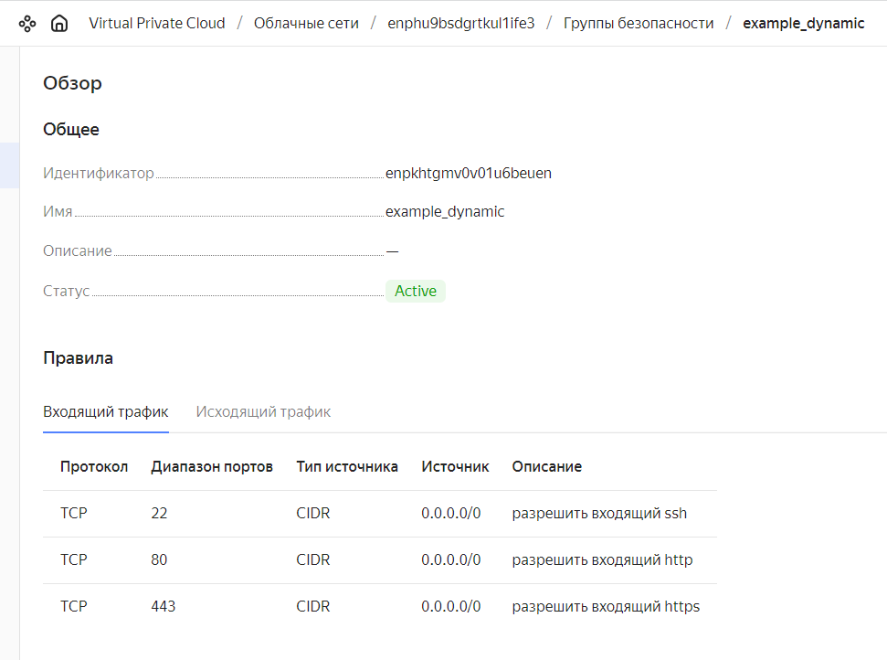
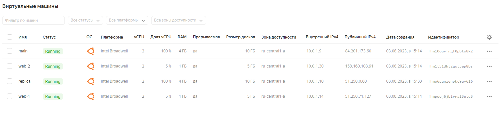
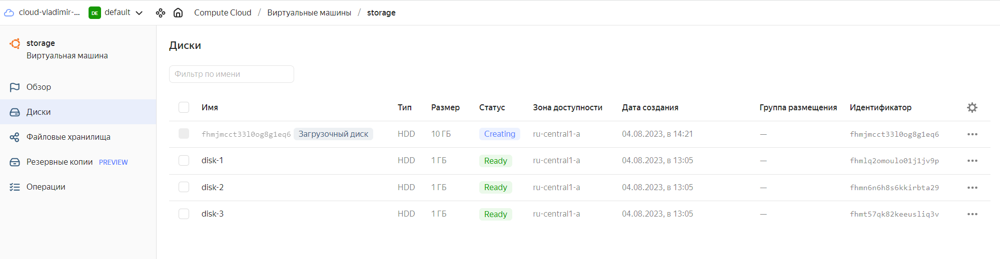
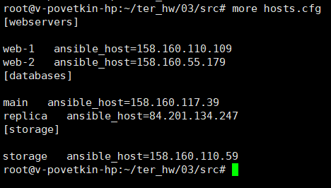

# Домашнее задание к занятию «Управляющие конструкции в коде Terraform»

*Ссылка на исходный код:* [SRC](./home_work/ter_03/src/)

## Задание 1

4. **Приложите скриншот входящих правил «Группы безопасности» в ЛК Yandex Cloud или скриншот отказа в предоставлении доступа к preview-версии.**

**Результат**: 

*скриншот входящих правил «Группы безопасности»*

## Задание 2

1. Создайте файл count-vm.tf. Опишите в нём создание двух одинаковых ВМ web-1 и web-2 (не web-0 и web-1) с минимальными параметрами, используя мета-аргумент count loop. Назначьте ВМ созданную в первом задании группу безопасности.(как это сделать узнайте в документации провайдера yandex/compute_instance )

2. Создайте файл for_each-vm.tf. Опишите в нём создание двух ВМ с именами "main" и "replica" разных по cpu/ram/disk , используя мета-аргумент for_each loop. Используйте для обеих ВМ одну общую переменную типа list(object({ vm_name=string, cpu=number, ram=number, disk=number })). При желании внесите в переменную все возможные параметры.

3. ВМ из пункта 2.2 должны создаваться после создания ВМ из пункта 2.1.
4. Используйте функцию file в local-переменной для считывания ключа ~/.ssh/id_rsa.pub и его последующего использования в блоке metadata, взятому из ДЗ 2.
5. Инициализируйте проект, выполните код.

* **Решение**

*Ссылка на исходный код:* [count_vm.tf](./home_work/ter_03/src/count_vm.tf)

*Ссылка на исходный код:* [for_each_vm.tf](./home_work/ter_03/src/for_each_vm.tf)

* **Результат**

## Задание 3

1. Создайте 3 одинаковых виртуальных диска размером 1 Гб с помощью ресурса yandex_compute_disk и мета-аргумента count в файле disk_vm.tf .
2. Создайте в том же файле одну ВМ c именем "storage" . Используйте блок dynamic secondary_disk{..} и мета-аргумент for_each для подключения созданных вами дополнительных дисков.

* **Решение**

*Ссылка на исходный код:* [disk_vm.tf](./home_work/ter_03/src/disk_vm.tf)

* **Результат**

## Задание 4

1. В файле ansible.tf создайте inventory-файл для ansible. Используйте функцию tepmplatefile и файл-шаблон для создания ansible inventory-файла из лекции. Готовый код возьмите из демонстрации к лекции demonstration2. Передайте в него в качестве переменных группы виртуальных машин из задания 2.1, 2.2 и 3.2, т. е. 5 ВМ.

2. Инвентарь должен содержать 3 группы [webservers], [databases], [storage] и быть динамическим, т. е. обработать как группу из 2-х ВМ, так и 999 ВМ.

3. Выполните код. Приложите скриншот получившегося файла.

Для общего зачёта создайте в вашем GitHub-репозитории новую ветку terraform-03. Закоммитьте в эту ветку свой финальный код проекта, пришлите ссылку на коммит.
Удалите все созданные ресурсы.

* **Решение**

*Ссылка на исходный код:* [ansible.tf](./home_work/ter_03/src/ansible.tf)

* **Результат**

