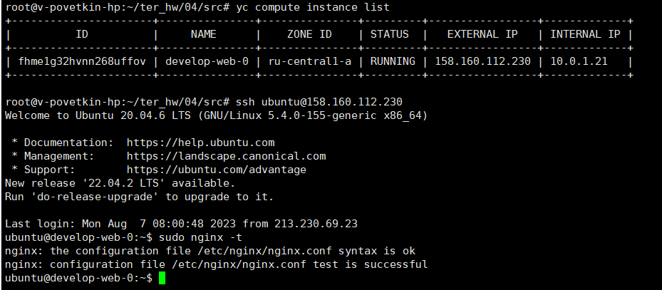
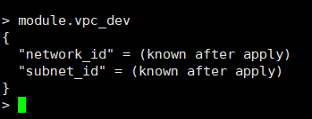
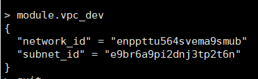
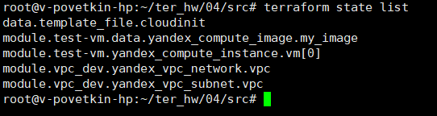
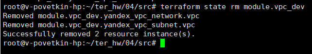
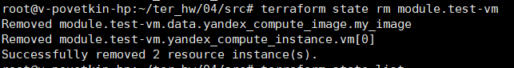
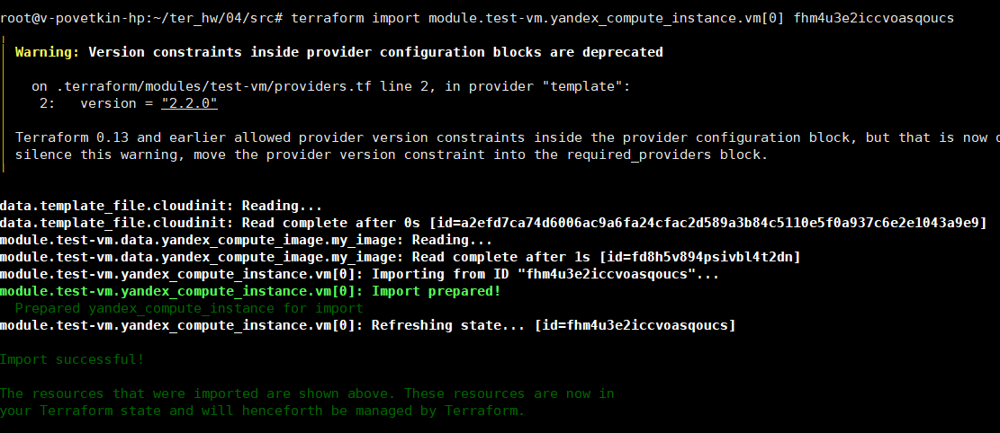
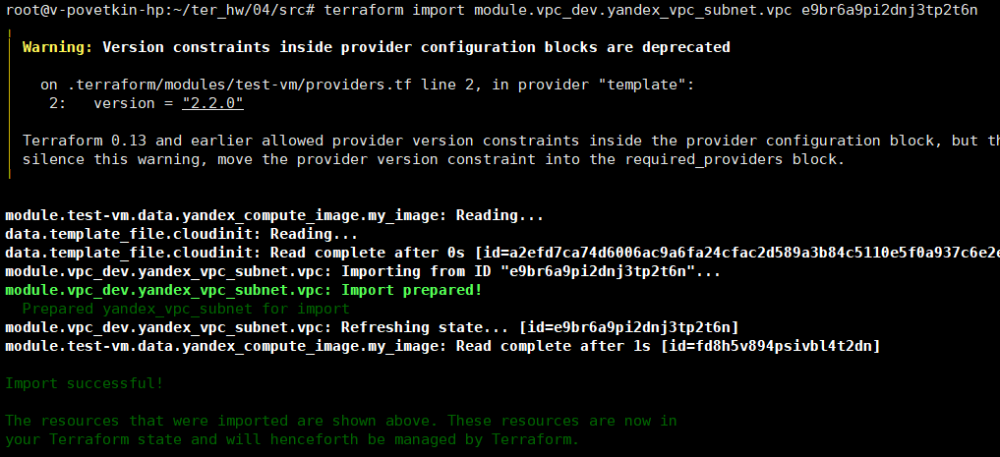
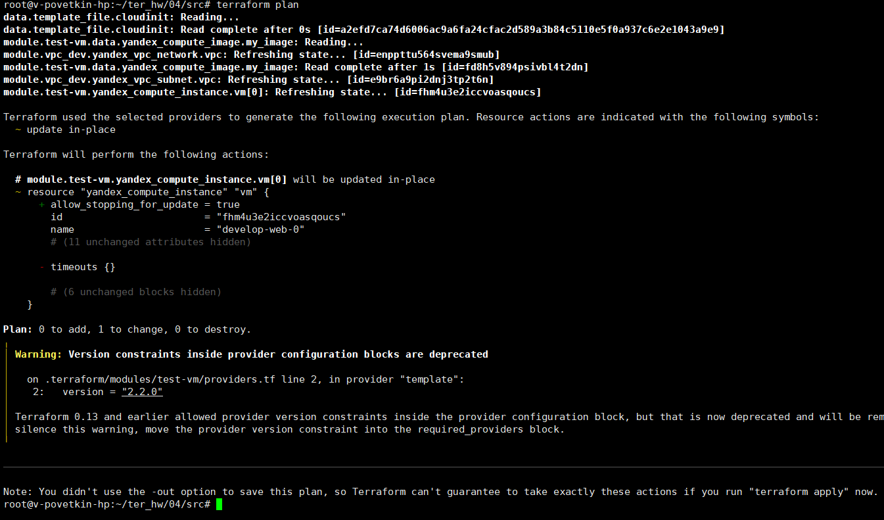

# Домашнее задание к занятию «Продвинутые методы работы с Terraform»

*Ссылка на исходный код:* [SRC](./home_work/ter_04/src/)

## Задание 1

1. Возьмите из демонстрации к лекции готовый код для создания ВМ с помощью remote-модуля.
2. Создайте одну ВМ, используя этот модуль. В файле cloud-init.yml необходимо использовать переменную для ssh-ключа вместо хардкода. Передайте ssh-ключ в функцию template_file в блоке vars ={} . Воспользуйтесь примером. Обратите внимание, что ssh-authorized-keys принимает в себя список, а не строку.
3. Добавьте в файл cloud-init.yml установку nginx.
4. Предоставьте скриншот подключения к консоли и вывод команды sudo nginx -t.

**Результат**: 

*скриншот команды sudo nginx -t*

## Задание 2

1. Напишите локальный модуль vpc, который будет создавать 2 ресурса: одну сеть и одну подсеть в зоне, объявленной при вызове модуля, например: ru-central1-a.
2. Вы должны передать в модуль переменные с названием сети, zone и v4_cidr_blocks.

*Ссылка на исходный код:* [main.tf](./home_work/ter_04/src/main.tf#L1-L9)

3. Модуль должен возвращать в root module с помощью output информацию о yandex_vpc_subnet. Пришлите скриншот информации из terraform console о своем модуле. Пример: > module.vpc_dev

4. Замените ресурсы yandex_vpc_network и yandex_vpc_subnet созданным модулем. Не забудьте передать необходимые параметры сети из модуля vpc в модуль с виртуальной машиной.

*Ссылка на исходный код:* [main.tf](./home_work/ter_04/src/main.tf#L15-L18)

5. Откройте terraform console и предоставьте скриншот содержимого модуля. Пример: > module.vpc_dev.

6. Сгенерируйте документацию к модулю с помощью terraform-docs.

[VPC_DEV.md](./home_work/ter_04/task2/vpc_dev.md)

## Задание 3

1. Выведите список ресурсов в стейте.

> terraform state list

2. Полностью удалите из стейта модуль vpc.

> terraform state rm module.vpc_dev

3. Полностью удалите из стейта модуль vm.

> terraform state rm module.test-vm

4. Импортируйте всё обратно. Проверьте terraform plan. Изменений быть не должно. Приложите список выполненных команд и скриншоты процессы.

> terraform import module.test-vm.yandex_compute_instance.vm[0] fhm4u3e2iccvoasqoucs
> terraform import module.vpc_dev.yandex_vpc_network.vpc enppttu564svema9smub
> terraform import module.vpc_dev.yandex_vpc_subnet.vpc e9br6a9pi2dnj3tp2t6n

