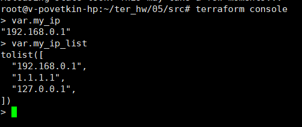
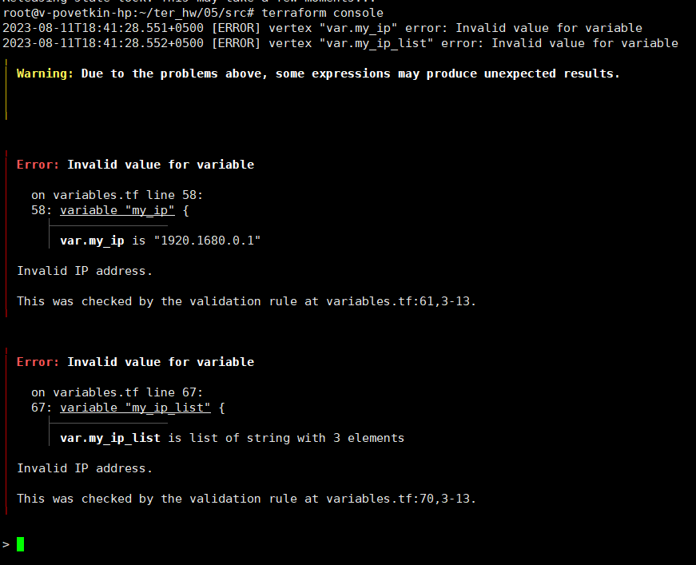

# Домашнее задание к занятию «Использование Terraform в команде»

**Ссылка на исходный код:** [SRC](./home_work/ter_05/src/)

## Задание 1

Возьмите код:

* из ДЗ к лекции 4,
* из демо к лекции 4.

2. Проверьте код с помощью tflint и checkov. Вам не нужно инициализировать этот проект.
3. Перечислите, какие типы ошибок обнаружены в проекте (без дублей).


**Результат TFLint**: 

> Warning: Module source "git::https://github.com/udjin10/yandex_compute_instance.git?ref=main" uses a default branch as ref (main) (terraform_module_pinned_source)
> Warning: Missing version constraint for provider ...
> Warning: [Fixable] variable <variable name> is declared but not used

**Результат Checkov**: 

```
Check: CKV_YC_4: "Ensure compute instance does not have serial console enabled."
	PASSED for resource: module.test-vm.yandex_compute_instance.vm[0]
	File: /tfplan.json:0-0
Check: CKV_YC_2: "Ensure compute instance does not have public IP."
	FAILED for resource: module.test-vm.yandex_compute_instance.vm[0]
	File: /tfplan.json:0-0
Check: CKV_YC_11: "Ensure security group is assigned to network interface."
	FAILED for resource: module.test-vm.yandex_compute_instance.vm[0]
	File: /tfplan.json:0-0

```

## Задание 2

1. Возьмите ваш GitHub-репозиторий с выполненным ДЗ 4 в ветке 'terraform-04' и сделайте из него ветку 'terraform-05'.
2. Повторите демонстрацию лекции: настройте YDB, S3 bucket, yandex service account, права доступа и мигрируйте state проекта в S3 с блокировками. Предоставьте скриншоты процесса в качестве ответа.


3. Закоммитьте в ветку 'terraform-05' все изменения.
4. Откройте в проекте terraform console, а в другом окне из этой же директории попробуйте запустить terraform apply.
5. Пришлите ответ об ошибке доступа к state.


6. Принудительно разблокируйте state. Пришлите команду и вывод.

> terraform force-unlock 1e1d918e-19ff-94bd-78a1-9da3940cc5f6


## Задание 3

1. Сделайте в GitHub из ветки 'terraform-05' новую ветку 'terraform-hotfix'.
2. Проверье код с помощью tflint и checkov, исправьте все предупреждения и ошибки в 'terraform-hotfix', сделайте коммит.
3. Откройте новый pull request 'terraform-hotfix' --> 'terraform-05'.
4. Вставьте в комментарий PR результат анализа tflint и checkov, план изменений инфраструктуры из вывода команды terraform plan.
5. Пришлите ссылку на PR для ревью. Вливать код в 'terraform-05' не нужно.


## Задание 4

1. Напишите переменные с валидацией и протестируйте их, заполнив default верными и неверными значениями. Предоставьте скриншоты проверок из terraform console.

type=string, description="ip-адрес" — проверка, что значение переменной содержит верный IP-адрес с помощью функций cidrhost() или regex(). Тесты: "192.168.0.1" и "1920.1680.0.1";
type=list(string), description="список ip-адресов" — проверка, что все адреса верны. Тесты: ["192.168.0.1", "1.1.1.1", "127.0.0.1"] и ["192.168.0.1", "1.1.1.1", "1270.0.0.1"].




