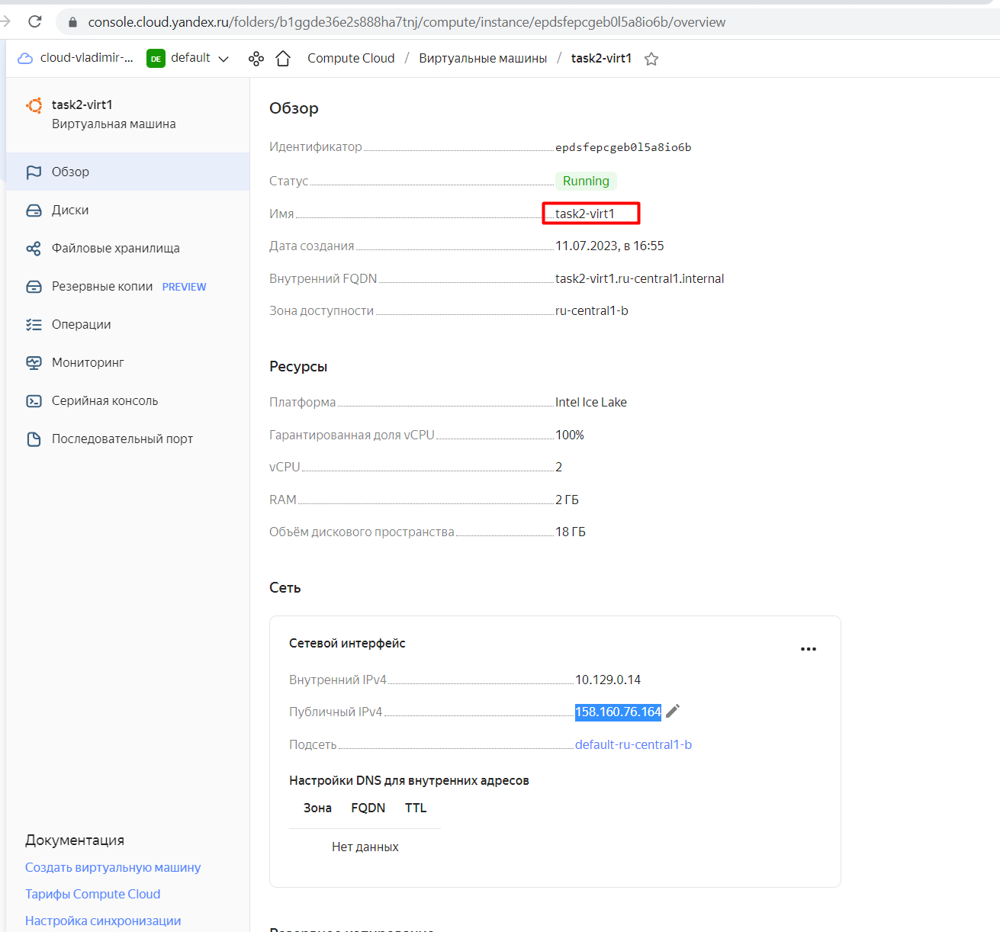

# Домашнее задание к занятию 4. «Оркестрация группой Docker-контейнеров на примере Docker Compose»

## Задача 1

**Создайте собственный образ любой операционной системы (например ubuntu-20.04) с помощью Packer (инструкция).**


## Задача 2

* 2.1

**Создайте вашу первую виртуальную машину в YandexCloud с помощью web-интерфейса YandexCloud.**



* 2.2

**Создайте вашу первую виртуальную машину в YandexCloud с помощью Terraform (вместо использования веб-интерфейса YandexCloud). Используйте Terraform-код в директории (src/terraform).**


```
root@v-povetkin-hp:/home/bova/virt4/task2_2# terraform apply

Terraform used the selected providers to generate the following execution plan. Resource actions are indicated with the following symbols:
  + create

Terraform will perform the following actions:

  # yandex_compute_instance.node01 will be created
  + resource "yandex_compute_instance" "node01" {
      + allow_stopping_for_update = true
      + created_at                = (known after apply)
      + folder_id                 = (known after apply)
      + fqdn                      = (known after apply)
      + gpu_cluster_id            = (known after apply)
      + hostname                  = "node01.netology.cloud"
      + id                        = (known after apply)
      + name                      = "node01"
      + network_acceleration_type = "standard"
      + platform_id               = "standard-v1"
      + service_account_id        = (known after apply)
      + status                    = (known after apply)
      + zone                      = "ru-central1-a"

      + boot_disk {
          + auto_delete = true
          + device_name = (known after apply)
          + disk_id     = (known after apply)
          + mode        = (known after apply)

          + initialize_params {
              + block_size  = (known after apply)
              + description = (known after apply)
              + image_id    = "fd8md6d8l1hhlel3on1v"
              + name        = "root-node01"
              + size        = 50
              + snapshot_id = (known after apply)
              + type        = "network-nvme"
            }
        }

      + network_interface {
          + index              = (known after apply)
          + ip_address         = (known after apply)
          + ipv4               = true
          + ipv6               = (known after apply)
          + ipv6_address       = (known after apply)
          + mac_address        = (known after apply)
          + nat                = true
          + nat_ip_address     = (known after apply)
          + nat_ip_version     = (known after apply)
          + security_group_ids = (known after apply)
          + subnet_id          = (known after apply)
        }

      + resources {
          + core_fraction = 100
          + cores         = 8
          + memory        = 8
        }
    }

  # yandex_vpc_network.default will be created
  + resource "yandex_vpc_network" "default" {
      + created_at                = (known after apply)
      + default_security_group_id = (known after apply)
      + folder_id                 = (known after apply)
      + id                        = (known after apply)
      + labels                    = (known after apply)
      + name                      = "net"
      + subnet_ids                = (known after apply)
    }

  # yandex_vpc_subnet.default will be created
  + resource "yandex_vpc_subnet" "default" {
      + created_at     = (known after apply)
      + folder_id      = (known after apply)
      + id             = (known after apply)
      + labels         = (known after apply)
      + name           = "subnet"
      + network_id     = (known after apply)
      + v4_cidr_blocks = [
          + "192.168.101.0/24",
        ]
      + v6_cidr_blocks = (known after apply)
      + zone           = "ru-central1-a"
    }

Plan: 3 to add, 0 to change, 0 to destroy.

Changes to Outputs:
  + external_ip_address_node01_yandex_cloud = (known after apply)
  + internal_ip_address_node01_yandex_cloud = (known after apply)

Do you want to perform these actions?
  Terraform will perform the actions described above.
  Only 'yes' will be accepted to approve.

  Enter a value: yes

yandex_vpc_network.default: Creating...
yandex_vpc_network.default: Creation complete after 2s [id=enpn4egjs8ddk0cnh86s]
yandex_vpc_subnet.default: Creating...
yandex_vpc_subnet.default: Creation complete after 1s [id=e9b3lsvj674gtc8aud8n]
yandex_compute_instance.node01: Creating...
yandex_compute_instance.node01: Still creating... [10s elapsed]
yandex_compute_instance.node01: Still creating... [20s elapsed]
yandex_compute_instance.node01: Still creating... [30s elapsed]
yandex_compute_instance.node01: Still creating... [40s elapsed]
yandex_compute_instance.node01: Still creating... [50s elapsed]
yandex_compute_instance.node01: Still creating... [1m0s elapsed]
yandex_compute_instance.node01: Creation complete after 1m0s [id=fhm7o3hopd1ebsrf6th9]

Apply complete! Resources: 3 added, 0 changed, 0 destroyed.

Outputs:

external_ip_address_node01_yandex_cloud = "84.201.174.31"
internal_ip_address_node01_yandex_cloud = "192.168.101.32"

```

## Задача 3

**С помощью Ansible и Docker Compose разверните на виртуальной машине из предыдущего задания систему мониторинга на основе Prometheus/Grafana. Используйте Ansible-код в директории (src/ansible).**


## Задача 4

1. Откройте веб-браузер, зайдите на страницу http://<внешний_ip_адрес_вашей_ВМ>:3000.
2. Используйте для авторизации логин и пароль из .env-file.
3. Изучите доступный интерфейс, найдите в интерфейсе автоматически созданные docker-compose-панели с графиками(dashboards).
4. Подождите 5-10 минут, чтобы система мониторинга успела накопить данные.


## Задача 5

**Создайте вторую ВМ и подключите её к мониторингу, развёрнутому на первом сервере.**


