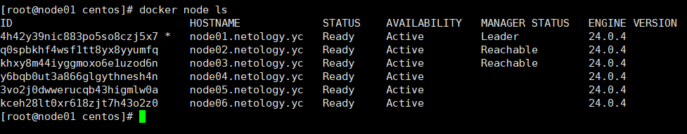
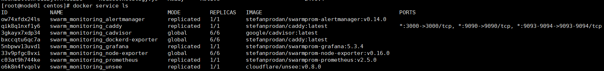

# Домашнее задание к занятию 5. «Оркестрация кластером Docker контейнеров на примере Docker Swarm»

## Задача 1

**В чём отличие режимов работы сервисов в Docker Swarm-кластере: replication и global?**

* replication - сервисы запускаются на воркер-нодах в соответствии с настройками репликации
* global - сервис запускается на каждой воркер-ноде

**Какой алгоритм выбора лидера используется в Docker Swarm-кластере?**

Raft Consensus Algorithm. Raft использует рандомизированные таймеры во время избрания нового лидера.

**Что такое Overlay Network?**

Распределеная сеть между docker узлами, которая работает поверх сети хоста. Docker берет на себя вопросы маршрутизации пакетов до нужного контейнера. Также позволяет безопастно взаимодействовать контейнерам при включенном шифровании.


## Задача 2

**Создайте ваш первый Docker Swarm-кластер в Яндекс Облаке.***

docker node ls




## Задача 3

**Создайте ваш первый, готовый к боевой эксплуатации кластер мониторинга, состоящий из стека микросервисов.**

docker service ls



## Задача 4 (*)


** Выполните на лидере Docker Swarm-кластера команду, указанную ниже, и дайте письменное описание её функционала — что она делает и зачем нужна:**

```
# см.документацию: https://docs.docker.com/engine/swarm/swarm_manager_locking/
docker swarm update --autolock=true
```

Эта функция называется автоблокировкой. 
Используется для шифрования связи между узлами и шифрования Raft-журнала. 
После включения этой функции, при перезагрузке докера необходимо будет ввести токен для разблокировки.
